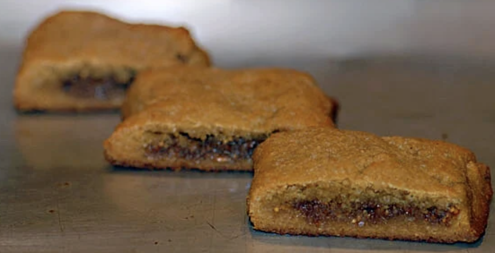

## PREP

# INGREDIENTS

#### Filling:

- 1 cup [dried figs](https://click.linksynergy.com/deeplink?id=IQTouyX28Mk&mid=49422&murl=https%3A%2F%2Fnuts.com%2Fdriedfruit%2Ffigs%2Forganic)
- ½ cup lemon juice, freshly squeezed
- 1 tablespoon [vanilla extract](http://www.amazon.com/gp/product/B001HTI88E/ref=as_li_tl?ie=UTF8&camp=1789&creative=390957&creativeASIN=B001HTI88E&linkCode=as2&tag=elaspan-20&linkId=IPIOAMXJ66Q5QCT7)

#### Cookie:

- 2½ cups [blanched almond flour (not almond meal)](https://www.amazon.com/Wellbees-Super-Blanched-Almond-Powder/dp/B00CLLV2D0/ref=as_li_ss_tl?dchild=1&keywords=wellbees&qid=1586298364&sr=8-4&th=1&linkCode=ll1&tag=elaspan-20&linkId=0c3766bacfca76b919543b7c75c0dfac&language=en_US)
- ½ teaspoon [celtic sea salt](https://www.amazon.com/Celtic-Sea-Salt-Resealable-Paleo-Friendly/dp/B009NT3JD4?crid=2QVX80JKJN8GT&keywords=celtic%2Bsea%2Bsalt&qid=1682440461&sprefix=celtic%2Bsea%2Bsal%2Caps%2C131&sr=8-4&th=1&linkCode=ll1&tag=elaspan-20&linkId=c35e6035c3d9ceec0520597e5267e691&language=en_US&ref_=as_li_ss_tl)
- ½ cup [agave nectar](https://www.amazon.com/Madhava-Naturally-Organic-Low-Glycemic-Sweetener/dp/B003ZMRBS4?crid=1BY95V91Q3Q33&keywords=Madhava+Natural+Sweeteners%2C+Organic%2C+Golden+Light%2C+Blue+Agave&qid=1666813592&qu=eyJxc2MiOiIxLjAyIiwicXNhIjoiMC4wMCIsInFzcCI6IjAuMDAifQ%3D%3D&sprefix=madhava+natural+sweeteners%2C+organic%2C+golden+light%2C+blue+agave%2Caps%2C112&sr=8-7&linkCode=ll1&tag=elaspan-20&linkId=c56ae62daa3fff079f28b031f2929f69&language=en_US&ref_=as_li_ss_tl) or [honey](https://www.amazon.com/Organic-Raw-Honey-16-Liquid/dp/B0054RTAFK/ref=as_li_ss_tl?ie=UTF8&qid=1467220738&sr=8-2-fkmr0&keywords=Wholesome+Sweeteners,+Inc.,+Organic+Raw+Honey&linkCode=ll1&tag=elaspan-20&linkId=39da59b61edca7dd2b3c672f3c5b16f4)
- ¼ cup [yacon syrup](https://www.amazon.com/Pure-Yacon-Syrup-Gold-Substitute/dp/B00GOFSEGC/ref=as_li_ss_tl?ie=UTF8&qid=1467240965&sr=8-3&keywords=yacon+syrup&linkCode=ll1&tag=elaspan-20&linkId=303f764174b420cf6a11a54ee755338e)
- ¼ cup [grapeseed oil](https://www.amazon.com/Spectrum-Naturals-Grapeseed-Oil-16/dp/B007BLAZ4M/ref=as_li_ss_tl?ie=UTF8&qid=1467219506&sr=8-1&keywords=Spectrum+Naturals,+Grapeseed+Oil&linkCode=ll1&tag=elaspan-20&linkId=aad66c218dffd2f79b375be059eac246) or [palm shortening](https://www.amazon.com/Spectrum-Naturals-Organic-Vegetable-Shortening/dp/B00VX91OCU/ref=as_li_ss_tl?ie=UTF8&qid=1467223679&sr=8-1&keywords=Spectrum+Naturals,+Organic+All+Vegetable+Shortening,+24+oz+(680+g)&linkCode=ll1&tag=elaspan-20&linkId=bfbb4c5179ecd413f5a7088e78c3629d)
- 1 tablespoon [vanilla extract](http://www.amazon.com/gp/product/B001HTI88E/ref=as_li_tl?ie=UTF8&camp=1789&creative=390957&creativeASIN=B001HTI88E&linkCode=as2&tag=elaspan-20&linkId=IPIOAMXJ66Q5QCT7)

# INSTRUCTIONS

- Place figs in a [food processor](https://www.amazon.com/Cuisinart-FP-11GM-Elemental-Processor-Gunmetal/dp/B0103JJJ4A?crid=340PRZ6OKAED9&cv_ct_cx=cuisinart%2Bfood%2Bprocessor&keywords=cuisinart%2Bfood%2Bprocessor&pd_rd_i=B0103JJJ4A&pd_rd_r=04edd27b-02f9-456f-acf4-7e251c29e0e5&pd_rd_w=wSEic&pd_rd_wg=Ky9Ul&pf_rd_p=34f9b464-bca8-45b3-9c64-0e61b00f319e&pf_rd_r=6324K1JR42D1NP9B3B0T&qid=1642439425&sprefix=cuisinart%2Bfood%2Bprocessor%2Caps%2C124&sr=1-1-a8004193-6951-43f6-852a-aff7dbba9115-spons&spLa=ZW5jcnlwdGVkUXVhbGlmaWVyPUE4WjRIRjROSUdWUzUmZW5jcnlwdGVkSWQ9QTAzNjM3NjQyMENGSktKMzBMNzA1JmVuY3J5cHRlZEFkSWQ9QTAxNjUwODkyRUpEUDUzUFoxODJWJndpZGdldE5hbWU9c3Bfc2VhcmNoX3RoZW1hdGljJmFjdGlvbj1jbGlja1JlZGlyZWN0JmRvTm90TG9nQ2xpY2s9dHJ1ZQ&th=1&linkCode=ll1&tag=elaspan-20&linkId=cf96973e798b45ee14877eceababc402&language=en_US&ref_=as_li_ss_tl) and blend for 30 seconds until they are well chopped
    
- Add lemon juice and vanilla; process until a smooth paste results
    
- In a [large bowl](https://www.amazon.com/Cuisinart-CTG-00-SMB-Stainless-Steel-Mixing/dp/B004YZEO9K/ref=as_li_ss_tl?s=kitchen&ie=UTF8&qid=1467933051&sr=1-7&keywords=stainless+steel+bowls&linkCode=ll1&tag=elaspan-20&linkId=1c05bae060b58565af71caf471ff0aea), combine almond flour and salt
    
- In a [small bowl](https://www.amazon.com/Cuisinart-CTG-00-SMB-Stainless-Steel-Mixing/dp/B004YZEO9K/ref=as_li_ss_tl?s=kitchen&ie=UTF8&qid=1467933051&sr=1-7&keywords=stainless+steel+bowls&linkCode=ll1&tag=elaspan-20&linkId=1c05bae060b58565af71caf471ff0aea), combine agave, yacon, grapeseed oil and vanilla
    
- Mix wet ingredients into dry, then refrigerate dough for 1 hour
    
- Divide chilled dough into 4 parts
    
- Between 2 pieces of [parchment paper](http://www.amazon.com/gp/product/B001IZIC8I/ref=as_li_ss_tl?ie=UTF8&camp=1789&creative=390957&creativeASIN=B001IZIC8I&linkCode=as2&tag=elaspan-20), roll out 1 part of the dough into a 10 x 4 inch rectangle, ¼ inch thick
    
- Spread ¼ of the filling evenly down the right side (lengthwise) of the rectangle
    
- Fold the dough in half down the long side --resulting in a 10 x 2 inch bar
    
- "Mend" the seam so the bar is symmetrical
    
- Repeat with 3 remaining parts of dough and filling
    
- Transfer each bar to a [parchment paper](http://www.amazon.com/gp/product/B001IZIC8I/ref=as_li_ss_tl?ie=UTF8&camp=1789&creative=390957&creativeASIN=B001IZIC8I&linkCode=as2&tag=elaspan-20) lined [baking sheet](https://www.amazon.com/Chicago-Metallic-Commercial-Traditional-Jelly-Roll/dp/B003YKGRPK?crid=3SN3HKKJ2OB2R&keywords=chicago%2Bmetallic%2Bbaking%2Bsheet&qid=1687216162&sprefix=chicago%2Bmetallic%2Bbaking%2Bsheet%2Caps%2C115&sr=8-4&th=1&linkCode=ll1&tag=elaspan-20&linkId=e37703eec9686d895ddfdb23352e8757&language=en_US&ref_=as_li_ss_tl); bake at 350°F for 10-15 minutes
    
- Allow to cool slightly; cut bar every 2 inches to form the fig newtons
    
- Serve

## NUTRITIONS

## NOTES

## TIPS

