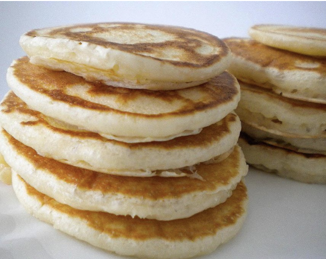

###### *RELATED* : 
---
These pancakes are extremely thick and fluffy owing to the egg whites. The combination of coconut flour and egg whites delivers an ultra-fluffy and filling pancake. The benefits of coconut flour are endless. It aids in a healthy metabolism, its high in fibre, it helps maintain healthy blood sugar levels and it helps maintain good digestive health.

---
## PREP

---
# INGREDIENTS

- [ ] 3 tablespoons coconut flour
    
- 1-2 tablespoons granulated sweetener of choice
    
- Pinch of baking powder
    
- Pinch of sea salt
    
- 3 large egg whites at room temperature(for vegan option, use 1 tablespoon and 1 teaspoon Ener-G egg replacer mixed with cup water OR 3 tablespoons flax mixed with 9 tablespoons water)
    
- 1 tablespoon mashed pumpkin OR applesauce OR mashed sweet potato OR yogurt of your choice.
    
- ¼ – ½ cup dairy free milk of your choice
    
- ½ tsp vanilla extract

**INGREDIENTS FOR THE COCONUT BUTTER VANILLA GLAZE**

- 1 tablespoon coconut butter
    
- 2 tablespoons dairy free milk of your choice
    
- 1 tablespoon granulated sweetener of your choice
    
- ½ teaspoon vanilla extract

---
# INSTRUCTIONS

- [ ] - Sift the coconut flour, granulated sweetener of choice, sea salt and baking powder in a large bowl. Mix well to combine.
    
- In a small bowl (preferably a glass or metal bowl), whisk the egg whites or flax egg until still peaks form. Make sure the eggs are at room temperature – this gives greater volume. Add the vanilla extract and beat again until combined.
    
- Add the dry ingredients, along with the mashed pumpkin and stir briefly with a metal spoon.
    
- Add the dairy free milk, a tablespoon at a time, until a thick batter is formed (you may need more then mentioned).
    
- Mix lightly with a metal spoon, but do not overmix.
    
- Spray a frying pan with non-stick cooking spray and heat on low-medium.
    
- Once the pan is hot, pour a ¼ cup of batter into the pan.
    
- Cook pancakes for 2-3 minutes or until the edges brown.
    
- Flip very gently and cook for a further minute or two, until cooked through. A gentle tap with the back of your nail should produce a hollow sound when cooked.
    
- Repeat until all the pancakes are cooked.
    
- To make the coconut butter vanilla glaze, whisk all the ingredients in a small bowl drizzle over pancakes. Add sprinkles or any other topping of your choice.

---
## NUTRITIONS

---
## NOTES

---
## TIPS

---
### *EXTRA* :

