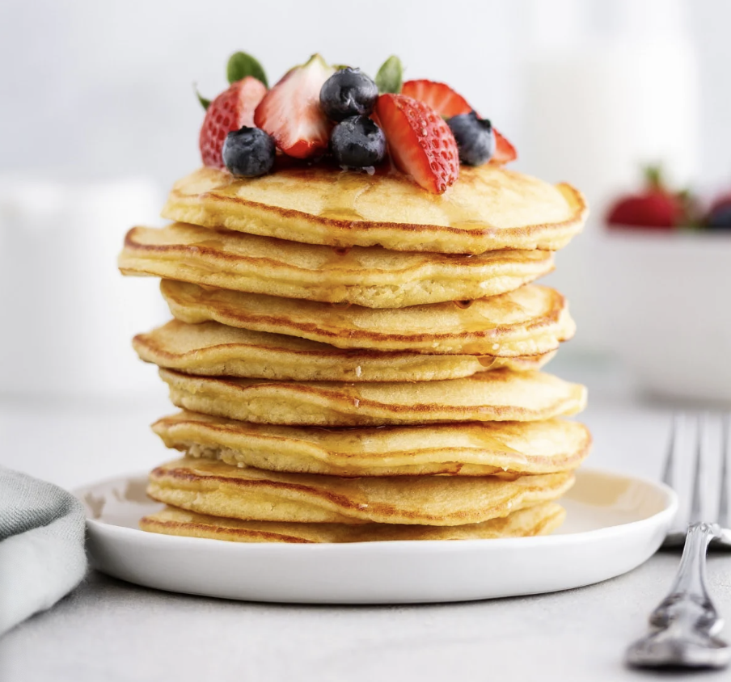
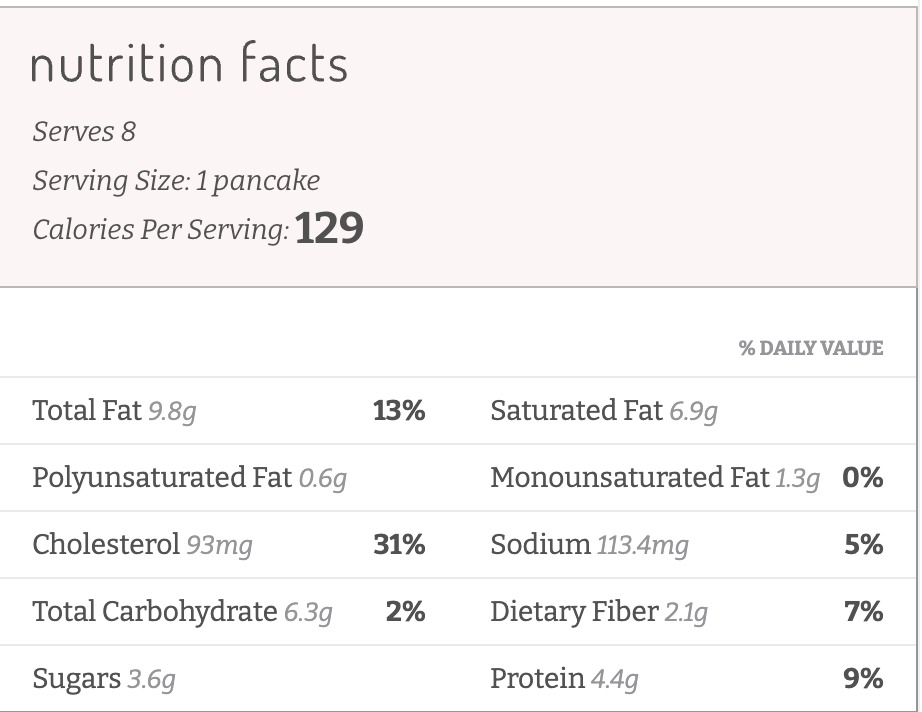

###### *RELATED* : 
---
_These coconut flour pancakes are what breakfast dreams are made of. Just a few simple ingredients come together to make fluffy and tender gluten free pancakes perfect for any morning of the week._

---
## PREP

---
# INGREDIENTS

- [ ] 4 eggs
- 1/4 cup coconut milk
- 3 tablespoons coconut oil, melted and cooled slightly
- 1 tablespoon raw honey
- 1/4 cup plus 2 tablespoons [Bob’s Red Mill coconut flour](https://amzn.to/2lpl0Vp)
- 1/4 teaspoon baking powder
- 1/4 teaspoon sea salt

---
# INSTRUCTIONS

- [ ] 1. Heat a griddle or large skillet over medium heat.
2. In a large bowl, whisk eggs, milk, melted coconut oil and honey until combined. In a separate medium bowl, whisk coconut flour, baking powder and salt until well blended.
3. Add dry ingredients to wet ingredients; stir with a fork until well combined and no lumps remain.
4. Grease griddle or skillet with oil. Drop ladlefuls of batter, a scant 1/4 cup each, onto hot griddle. Cook 3 to 4 minutes until small bubbles begin to form on top, then flip. Cook on other side 1 to 2 minutes until cooked through.
5. Serve warm with your favorite pancake toppings.

---
## NOTES

- I melted my coconut oil in a small saucepan over low heat just until it became a liquid. After letting it cool a minute or two, I then added it to the wet ingredients.
- Because the batter is more delicate than traditional pancake batter, it’s important to make smaller (1/4-cup amount) pancakes so you can flip them easily.

---
## TIPS

---
## NUTRITIONS

---
### *EXTRA* :

