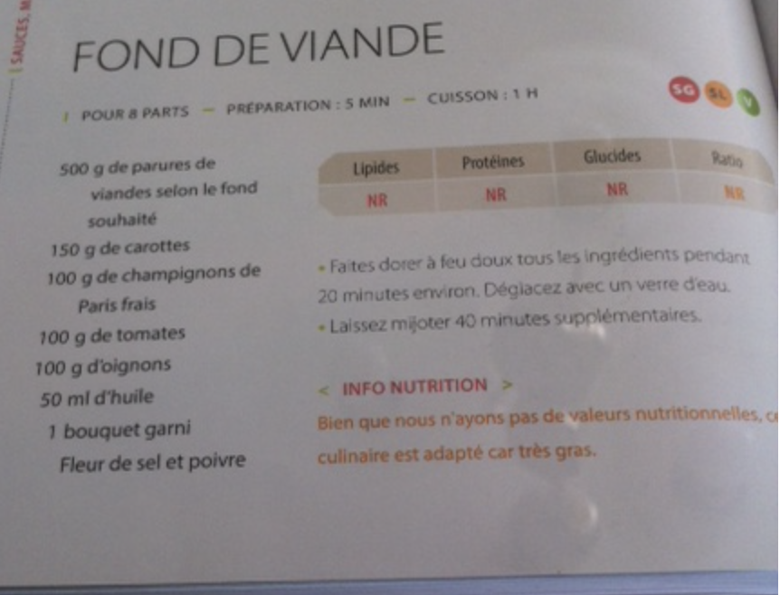

###### *RELATED* : 
---

---
## PREP | COMMENTS

---
# INGREDIENTS

- [ ] 500 g de parures de viandes selon le fond souhaite
- [ ] 150 g de carottes
- [ ] 100 g de champignons de Paris frais
- [ ] 100 g de tomates
- [ ] 100 g d'oignons
- [ ] 50 mi d’huile
- [ ] 1 bouquet garni
- [ ] Fleur de sel et poivre

---
# INSTRUCTIONS

1. Faites dorer a feu doux tous les ingredients pendant 20 minutes environ. Deglacez avec un verre d'eau
2. Laissez mijoter 40 minutes supplementaires.

---
## NOTES

---
## TIPS

---
## NUTRITIONS

---
### *EXTRA* :

