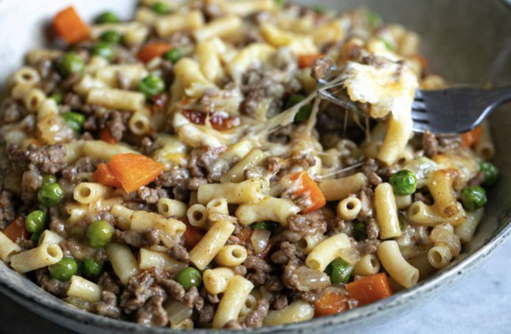

A packet of French onion soup mix gives this savoury mince some extra flavour, and baked with a cheesy topping in the oven, it’ll be a hit with the whole family.
- Greer Worsley

## PREP

# INGREDIENTS

150g macaroni (450)

1 tbsp olive oil (huile d'avocado)

1 brown onion, diced (3 moyens)

500g beef mince (2 lbs)

2 carrots, peeled and diced

40g sachet French onion soup mix (3 sachets)

1/4 cup tomato sauce (1 t.)

1 cup frozen peas

1 cup grated tasty cheese (3 cups)

# INSTRUCTIONS

Preheat oven to 180C (350). Grease an oven-proof baking dish.

Cook macaroni in salted boiling water until just al dente. Drain and set aside.

In a large frypan, heat oil over medium heat. Cook onion for 4 minutes until soft. Add mince and cook until well-browned, breaking apart with a wooden spoon. Add carrots and French onion soup mix and stir well. Pour in 2 cups water, bring to the boil, then reduce heat and simmer for 15 minutes. Stir through tomato sauce, peas and drained macaroni.

Transfer mixture to prepared baking dish. Top with cheese and bake for 15 minutes until golden and melted.

## NUTRITIONS

## NOTES

- Be sure to taste for seasoning - packet soup mixes can be salty so only add more if you need it.
- Add a mixture of tasty and mozzarella cheese for extra stretch.
- Recipe and photo by Greer Worsley.

## TIPS

### *EXTRA*

