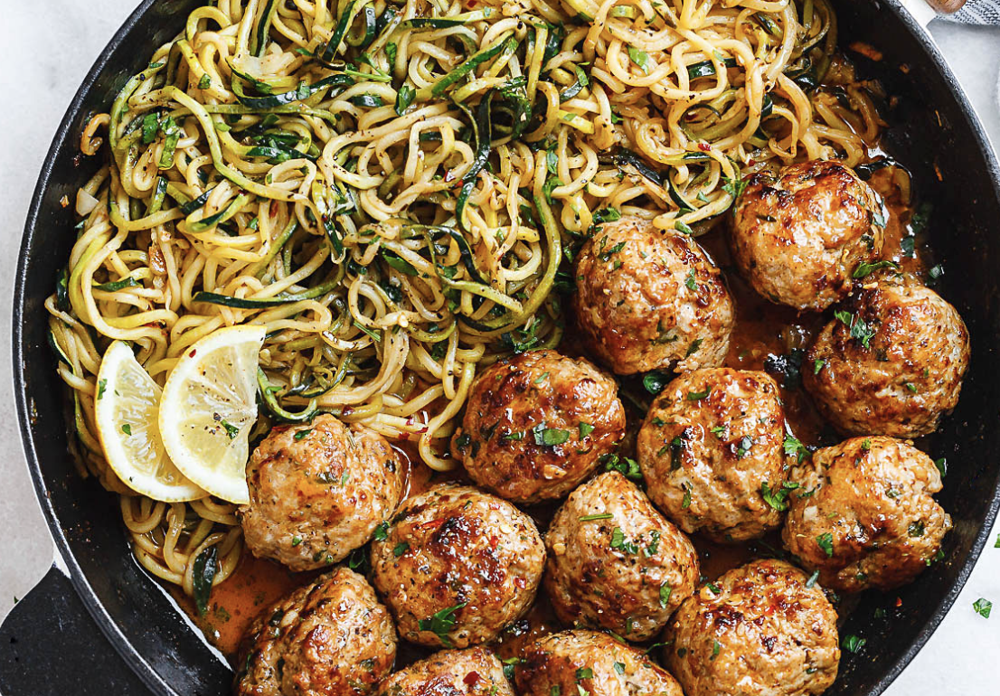
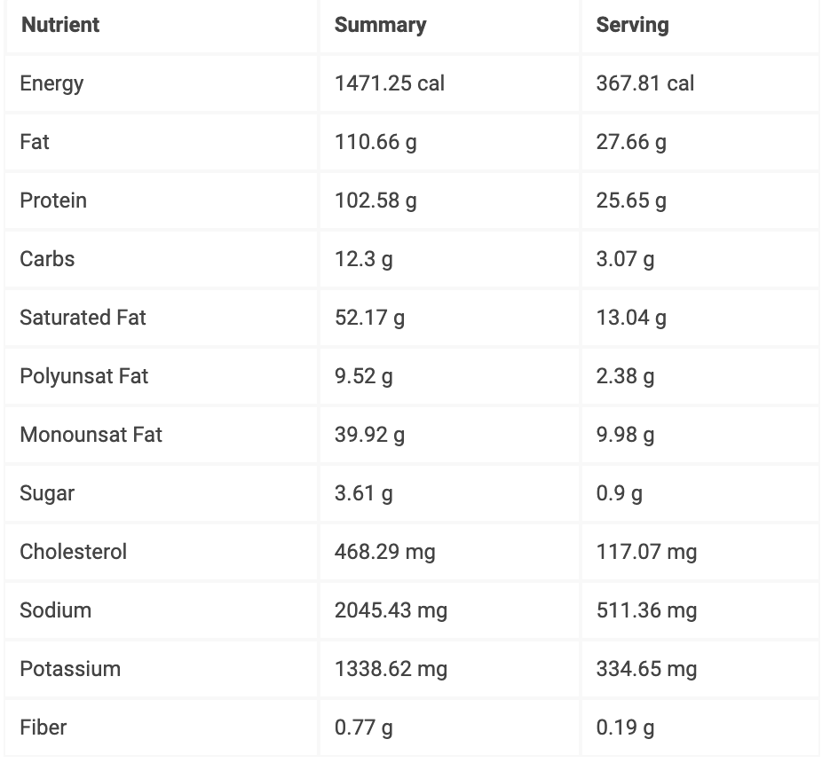

###### *RELATED* : 
---
Garlic Butter Turkey Meatballs Recipe with Zucchini Noodles – This easy and nourishing [skillet meal](https://www.eatwell101.com/tag/skillet-recipes "SKILLET RECIPES") with **turkey meatballs** and zucchini is absolutely fabulous in every way imaginable! Cheesy turkey and pork **meatballs** just melt in your mouth and zesty zucchini help keep carbs low. Gluten-free, paleo, low-carb, keto-friendly, and ready in 30 minutes or less  – This easy and **healthy turkey meatballs** dinner is a clear winner with the whole family! Enjoy!

---
## PREP | COMMENTS

---
# INGREDIENTS

- [ ] 1/2 lb (220g) **[ground turkey meat](https://amzn.to/2KhcQru) (or 1 lb and no pork)**
- [ ] 1/2 lb (220g) **[ground pork meat](https://amzn.to/34VmbNN)** (optional, see recipe notes)
- [ ] 1/2 cup shredded **[mozzarella](https://amzn.to/32FG9ud)** (or cheddar, provolone…) [Peut-être pas nécessaire]
- [ ] 4 cloves **[garlic](https://amzn.to/34ZxKU0)**, grated + 2 cloves **garlic**, minced [J'ai coupé l'ail très fin, pas râpé]
- [ ] 1 teaspoon **[Italian seasoning](https://amzn.to/2XZUz7v)**
- [ ] 1/2 teaspoon **[red crushed chili pepper flakes](https://amzn.to/2HArZ70)**, optiona
- [ ] 1 crumbled **[bouillon cube](https://amzn.to/2q9uTsZ)**, optional
- [ ] Salt and fresh cracked **[black pepper](https://amzn.to/2HBXlu2)**, to taste
- [ ] 1 cup fresh chopped **[cilantro](https://amzn.to/2QfYMm8)** (or parsley), divided
- [ ] 3 tablespoons **[butter](https://amzn.to/2NM07PG)**
- [ ] 4 medium **[zucchini](https://amzn.to/2q0IxPd)**, spiralized (fond énormément, donc pour 5 utiliser au moins 8 zucchinis et peut-être des pâtes ou du riz ou des pommes de terre
- [ ] Juice of 1/2 **[lemon](https://amzn.to/2QjyY8z)**
- [ ] 1 tablespoon **[hot sauce](https://amzn.to/2O4EyJi)** of your choice (we used **[Sriracha](https://amzn.to/2O4EyJi)**)

---
# INSTRUCTIONS

1.  [Zucchini] tends to render some water when cooking, so you can [sprinkle with salt after spiralizing and allow to sit for a couple of minutes to take off excess water.] Rinse well to get rid of salt and drain thoroughly in a colander before cooking.
2. To make the turkey meatballs: In a large bowl, combine ground turkey and ground pork, cheese, grated garlic, Italian seasoning, bouillon cube, red chili pepper flakes, chopped cilantro and black pepper. Mix well with your hands or fork and form medium balls. Arrange the turkey meatballs on a plate and set aside.
3. Melt 2 tablespoons butter in a [large skillet](https://amzn.to/2nOVV4f) over medium-low heat. Cook the **turkey meatballs** for 8 – 10 minutes on all sides, until browned and cooked through.    [Make sure to cook the meatballs on medium fire to avoid burning them while still raw in the inside.] While cooking, baste the meatballs with the mix of butter and juices. Remove to a clean plate and set aside.
4. In the same skillet melt remaining tablespoon butter; then add lemon juice, hot sauce, minced garlic, and red pepper flakes (if you want). Add the zucchini noodles and cook for 3 or 4 minutes, stirring regularly, until zucchini is done but still crisp and juices have reduced a bit. Adjust seasoning with salt and pepper and garnish with more cilantro or parsley if you like.
5.  Push zucchini on one side of the skillet and add the turkey meatballs back to the pan and reheat for a minute or two. Serve the **garlic butter turkey meatballs with lemon zucchini noodles** immediately with a lemon slice on the side. Enjoy!

---
## NOTES

Ground pork in this recipe allows the **meatballs** to be more juicy and tender. If you don’t eat pork, just double the amount of ground turkey, it’s delicious too!

This recipe is also perfect for a meal prep lunch on the next day. Check this [meatball meal prep recipe](https://www.eatwell101.com/meal-prep-garlic-butter-chicken-meatballs-recipe-zucchini-noodles) for a variant with chicken.

---
## TIPS

---
## NUTRITIONS

---
### *EXTRA* :

