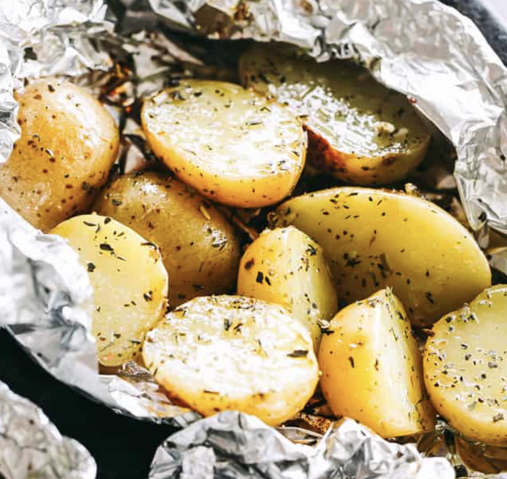

###### *RELATED* : 
---
These **Grilled Potatoes in Foil**, flavored with garlic, thyme, and rosemary, are absolutely delicious! Grilling gives them a perfect crispness, paired with a tempting smoky aroma.

---
## PREP | COMMENTS

Prep Time 10minutes mins
Cook Time 25minutes mins
Total Time 35minutes mins

### EQUIPMENT

- [Aluminum Foil](https://amzn.to/3XHFJRT)
- [Grill](https://amzn.to/42SHUUl)
- [Measuring Spoons](https://amzn.to/3HoDZWl)

---
# INGREDIENTS

- [ ] 2 pounds mini Yukon gold potatoes, rinsed, dried, and halved
- [ ] 2 tablespoons extra virgin olive oil
- [ ] 1 teaspoon garlic powder
- [ ] 1 teaspoon dried thyme
- [ ] 1 teaspoon dried rosemary
- [ ] salt and fresh ground black pepper, to taste
- [ ] chopped fresh parsley, for garnish

---
# INSTRUCTIONS

1. Preheat grill to medium-high.
2. Cut 4 large pieces of foil and set aside.
3. In a large bowl, combine potatoes with olive oil, garlic powder, thyme, rosemary, salt and pepper.
4. Divide potatoes between foil pieces.
5. Fold the sides of the foil over the potatoes, covering completely; seal the packets closed.
6. Place foil packets on the grill [la plaque du haut au moins pour partir] and cook until tender, about 20 to 30 minutes, turning once. Pierce with a fork to check for doneness. 
7. Remove from grill and carefully open up each packet.
8. Sprinkle with parsley and serve.

---
## NOTES

- You can **change up the flavors** of your grilled potatoes by trying different spices like paprika, dill, or parsley.
- **For a cheesy twist**, add some shredded cheddar or parmesan near the end of grilling.
- To make the dish heartier, **put in some chopped bacon or ham** before you grill.
- You can also **add more veggies**, like bell peppers, onions, or zucchini.
- If you like **softer potatoes**, keep them in the foil the whole time. For **crispier potatoe**s, open the foil near the end. If you’re in a hurry, you can boil the potatoes a bit before grilling.
- Don’t forget to **add plenty of seasoning** before wrapping them in foil. **Potatoes need a good amount of salt**.
- These potato packets can also be **prepared in the oven at 425˚F** for about 15 to 20 minutes or until fork tender.

---
## TIPS

---
## NUTRITIONS

Serving: 1 packet | Calories: 240 kcal | Carbohydrates: 40 g | Protein: 5 g | Fat: 7 g | Saturated Fat: 1 g | Polyunsaturated Fat: 1 g | Monounsaturated Fat: 5 g | Sodium: 14 mg | Potassium: 966 mg | Fiber: 5 g | Sugar: 2 g | Vitamin A: 15 IU | Vitamin C: 45 mg | Calcium: 33 mg | Iron: 2 mg | Net Carbs: 35 g

---
### *EXTRA* :

<iframe width="auto" height="auto" src="https://www.youtube.com/embed/XNfVjdZV87o"/>
 
