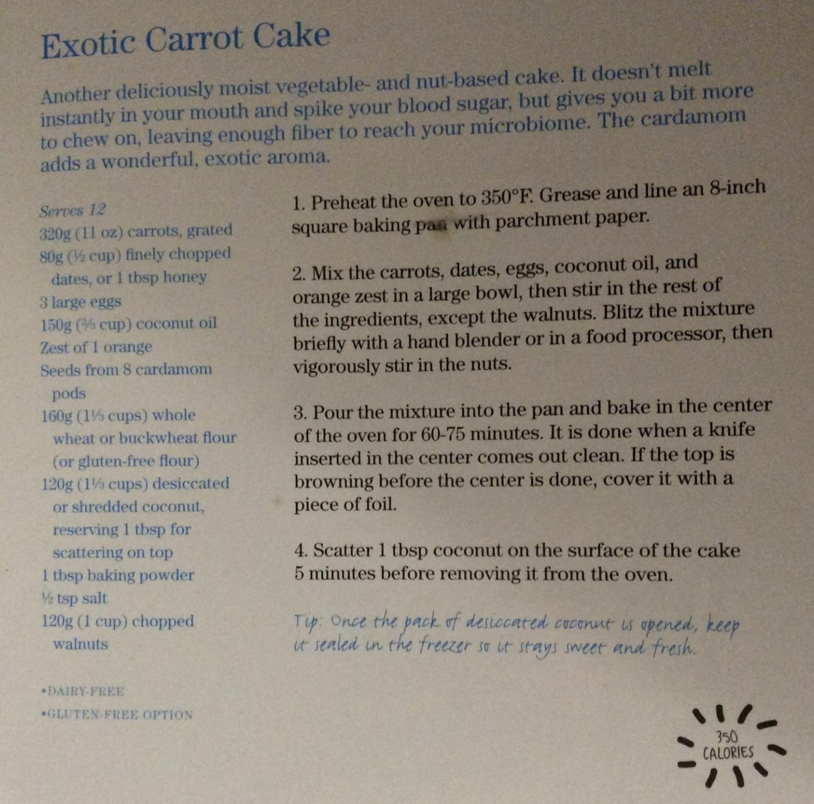

###### *RELATED* : 
---
Another deliciously moist vegetable- and nut-based cake. It doesn’t melt instantly in your mouth and spike your blood sugar, but gives you a bit more to chew on, leaving enough fiber to reach your microbiome. The cardamom adds a wonderful exotic aroma.

---
## PREP | COMMENTS

[Pour ce qui est de la cardamome j’ai écrasé sommairement les petites graines.]

[J’ai mis les dattes ainsi ... qu’une cuillère à thé et demie de miel. Bien que ce n’était pas nécessaire. Je ne l’ai pas regretté.]

[Et comme mentionné j’ai mis le crémage de maman.]

[Pour le temps de cuisson j’ai regardé à 60 min et cela était un peu trop pour mon four.]

---
# INGREDIENTS

- [ ] 320g (11 oz) carrots, grated
- [ ] 80g (1/2 cup) finely chopped dates, or 1 tbsp honey
- [ ] 3 large eggs
- [ ] 150g (1/2 cup) coconut oil
- [ ] Zest of 1 orange
- [ ] Seeds from 8 cardamom pods
- [ ] 160g (1 1/3 cups) whole wheat or buckwheat flour (or gluten-free flour)
- [ ] 120g (1 1/3 cups) desiccated or shredded coconut, reserving 1 tbsp for scattering on top
- [ ] 1 tbsp baking powder
- [ ] 1/2 tsp salt
- [ ] 120g (1 cup) chopped walnuts

---
# INSTRUCTIONS

1. Preheat the oven to 350°F. Grease and line an 8-inch square baking paa with parchment paper.

2. Mix the carrots, dates, eggs, coconut oil, and orange zest in a large bowl, then stir in the rest of the ingredients, except the walnuts. Blitz the mixture briefly with a hand blender or in a food processor, then vigorously stir in the nuts.

3. Pour the mixture into the pan and bake in the center of the oven for 60-75 minutes. It is done when a knife inserted in the center comes out clean. If the top is browning before the center is done, cover it with a piece of foil.

4. Scatter 1 tbsp coconut on the surface of the cake 5 minutes before removing it from the oven.

---
## NOTES

---
## TIPS

Tip: Once the pack of dessiccated coconut is opened, keep it sealed in the freezer so it stays sweet and fresh.

---
## NUTRITIONS

---
### *EXTRA* :

