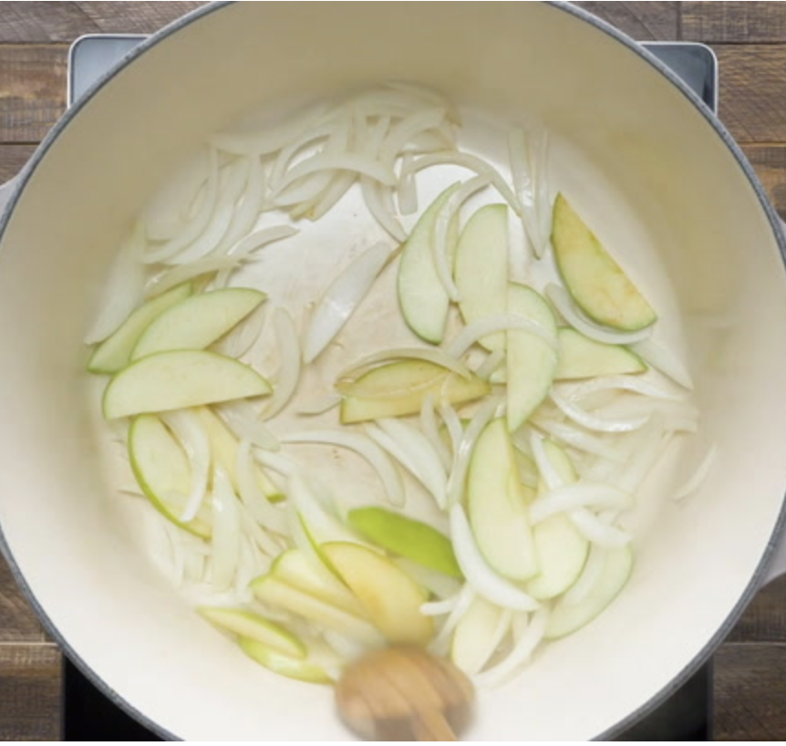

###### *RELATED* : 
---
Sunday afternoons were a time for family gatherings when I was a kid. While the uncles played cards, the aunts made treats such as this traditional German red cabbage recipe. —Jeannette Heim, Dunlap, Tennessee

---
## PREP | COMMENTS

Prep: 10 min. Cook: 65 min

---
# INGREDIENTS

- [ ] 1 medium onion, halved and sliced
- [ ] 1 medium apple, sliced
- [ ] 1 medium head red cabbage, shredded (about 8 cups)
- [ ] 1/3 cup sugar
- [ ] 1/3 cup white vinegar
- [ ] 3/4 teaspoon salt, optional
- [ ] 1/4 teaspoon pepper

---
# INSTRUCTIONS

1. In a large Dutch oven coated with cooking spray, cook and stir onion and apple over medium heat until onion is tender, about 5 minutes. Stir in remaining ingredients; cook, covered, until cabbage is tender, about 1 hour, stirring occasionally. Serve warm or cold.

---
## NOTES

---
## TIPS

### Is red cabbage good for you?

Yes, red cabbage is good for you! Red cabbage contains antioxidant-rich, immunity-boosting vitamin C, as well as many other important vitamins and minerals, including vitamin A and potassium. It is also low in calories and a good source of dietary fiber.

### What's the best way to cut red cabbage?

To cut red cabbage, first rinse and remove any outer leaves that are wilted or dry. With a chef’s knife, slice off the root end, then cut the cabbage in half through the stem. Slice the cabbage into quarters, diagonally cutting out the root. Finally, thinly slice the cabbage in the short direction, which makes it easier to eat. You can also shred your cabbage using a food processor blade, mandoline or cheese grater.

### What can you do with leftover red cabbage?

There are plenty of recipes you can make with leftover red cabbage. Toss the leftovers into a mixed greens salad or make a pretty slaw, like [raspberry slaw](https://www.tasteofhome.com/recipes/ruby-raspberry-slaw/) or [spinach slaw](https://www.tasteofhome.com/recipes/spinach-slaw/). You can also use leftover cabbage to make [red cabbage casserole](https://www.tasteofhome.com/recipes/red-cabbage-casserole/), [beef cabbage stew](https://www.tasteofhome.com/recipes/beefy-cabbage-bean-stew/) or any of these other [cabbage recipes](https://www.tasteofhome.com/collection/favorite-cabbage-recipes/).

---
## NUTRITIONS

1 cup: 64 calories, 0 fat (0 saturated fat), 0 cholesterol, 23mg sodium, 16g carbohydrate (12g sugars, 2g fiber), 1g protein. ****Diabetic Exchanges**:** 1 vegetable, 1/2 starch.

---
### *EXTRA* :

