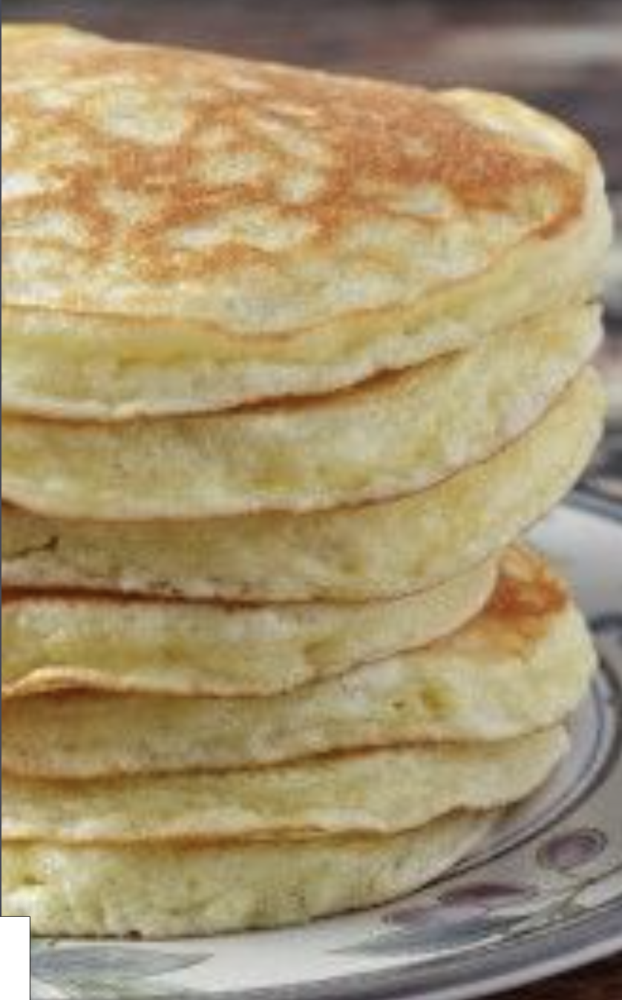

###### *RELATED* : 
---
Gluten Free Quick And Easy Morning Pancakes

---
## PREP

---
# INGREDIENTS

Refrigerated

- [ ] 3 Eggs

Baking & Spices

• 1 1 1/4 cups Cup 4 cup gluten free flour

• 3 tsp Baking powder

• 3/4 tsp Salt

• 3 tbsp Sugar

Dairy

• 3 tbsp Butter

• 1 1/4 cups Milk

---
# INSTRUCTIONS

- [ ] 

---
## NUTRITIONS

---
## NOTES

---
## TIPS

---
### *EXTRA* :

