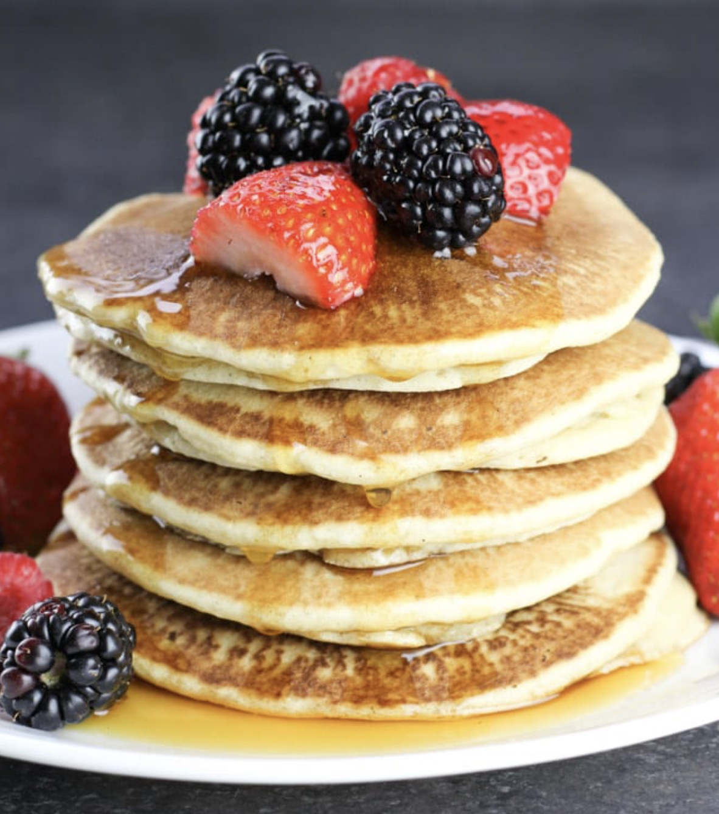

###### *RELATED* : 
---
Best Gluten Free Buttermilk Pancakes recipe, the only _recipe_ you’ll ever need for classic buttermilk pancakes that are light and fluffy. Just 77 calories per pancake!

---
## PREP

---
# INGREDIENTS

- [ ] 1 3/4 cup (260grams) gluten-free baking flour
- [ ] 1 1/2 teaspoon baking powder
- 1 teaspoon baking soda
- 1/2 teaspoon salt
- 2 Tablespoon cane sugar
- 2 eggs
- 1 1/4 cup (312ml) unsweetened almond milk
- 1/2 teaspoon apple cider vinegar
- 1/2 teaspoon vanilla extract

---
# INSTRUCTIONS

- [ ] 1. In a large bowl, whisk together flour, baking powder, baking soda, salt and sugar.
- 2. Make a well in the center, add eggs, milk, apple cider vinegar and vanilla extract; mix until smooth.
- 3. Heat a lightly oiled frying pan over medium high heat.
- 4. Pour approximately 1/4 cup cup for each pancake on to griddle. Spread batter with spoon to make pancake a thinner style pancake.
- 5. Brown on both sides and serve hot.

---
## NOTES

---
## TIPS

---
## NUTRITIONS

Serving size: 1 pancake  
Calories: 77  
Other nutrition information: Total Fat: 2g , Saturated Fat: .3g , Trans Fat: 0g , Cholesterol: 31mg , Sodium: 26mg , Total Carb: 14g , Dietary Fiber: 2g , Sugars: 2g , Protein: 3g

---
### *EXTRA* :

