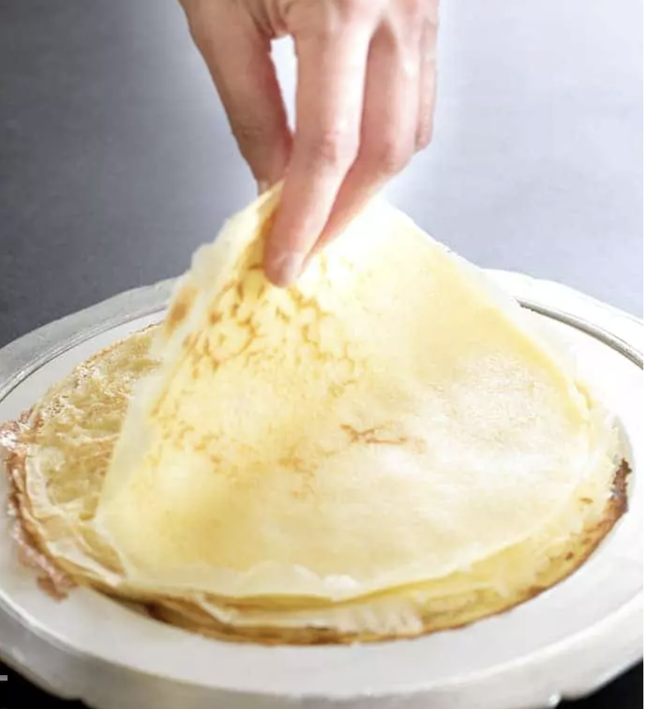

###### *RELATED* : 
---

---
## PREP

---
# INGREDIENTS

- [ ] **1 3/4 cups (245 g) xanthan gum-free gluten free flour blend (162 grams superfine white rice flour + 54 grams potato starch + 29 grams tapioca starch/flour)**
- [ ] **1/4 teaspoon kosher salt**
- [ ] **3 eggs (180 g, out of shell) at room temperature, beaten**
- [ ] **2 tablespoons (28 g) unsalted butter, melted and cooled [huile de coco à essayer=bon]** **[18 oct 2017 essai avec huile d’avocado]**
- [ ] **2 cups (16 fl. oz.) milk, at room temperature [très bon avec du lait de coco) 18 oct 2017 essai avec eau]**

---
# INSTRUCTIONS

- [ ] **In a large bowl, place the flour blend and salt, and whisk to combine well. In a separate, small bowl, place the eggs, butter and milk, and whisk to combine well. Create a well in the center of the flour and pour in the wet ingredients. Whisk until very well combined. The batter will thicken a bit as you whisk.**
- [ ] **For best results, cover the bowl and place the batter in the refrigerator overnight or for up to 2 days. Before using the batter, remove it from the refrigerator, whisk until smooth, and allow it come to room temperature. The batter should be about the consistency of half and half (thicker than milk, thinner than heavy cream). Transfer the batter to a large spouted measuring cup.**
- [ ] **Heat a heavy-bottom nonstick 9 inch skillet (or a well-seasoned and lightly greased 9 inch cast iron skillet) over medium heat for 2 minutes. Holding the warm skillet just above the flame, carefully pour about 5 tablespoons (a bit more than 1/4 cup) of batter right into the center of the skillet and swirl the pan to distribute the batter evenly across the entire flat surface of the pan. Once you get a rhythm going, you should be able to begin swirling as soon as the first drop of batter hits the pan. Cook over medium heat until the edges and underside of the crêpe are lightly golden brown (about 90 seconds). With a wide spatula (and/or your fingers, carefully), turn the crêpe over and cook until the other side is lightly golden brown (about another 45 seconds). Slide the crêpe out of the skillet onto a parchment-lined plate. Repeat with the remaining batter, stacking the finished crêpes on top of one another.**
- [ ] **The crêpes may be covered well with a moist towel and kept at room temperature for about 2 hours until you are ready to serve them, or wrapped tightly in freezer-safe wrap and frozen until ready to use. Defrost at room temperature, and refresh the crêpes in a warm, nonstick skillet for a few moments per side, per crêpe.**

---
## NOTES

---
## TIPS

---
## NUTRITIONS

---
### *EXTRA* :

