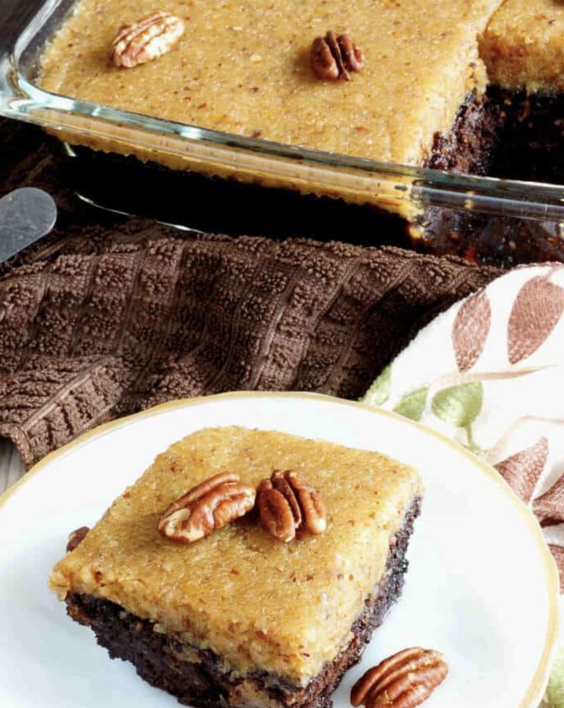

###### *RELATED* : 
---
_A delicious sugar free and gluten free German chocolate cake. This paleo friendly coconut flour based zucchini chocolate cake is super moist._

---
## PREP | COMMENTS

---
# INGREDIENTS

#### Cake

- [ ] 1/2 cup [coconut flour](https://www.amazon.com/Bobs-Red-Mill-Organic-Coconut/dp/B00MFC5JVQ?tag=sugfrelowca0c-20)
- [ ] 1/2 cup unsweetened cocoa powder
- [ ] 1 cup [low carb sweetener](https://www.lakanto.com/collections/sales-title/products/lakanto-classic-sugar-free-sweetener-family-size-800g?aff=41) I used 1/2 cup Pyure
- [ ] 1/2 teaspoon ground cinnamon
- [ ] 1 teaspoon baking soda
- [ ] 1 teaspoon [baking powder](http://allnaturalideas.com/aluminum-and-grain-free-baking-powder/)
- [ ] 1/4 teaspoon salt
- [ ] 1/4 cup coconut oil liquified
- [ ] 4 large eggs beaten
- [ ] 1 teaspoon vanilla
- [ ] 2 cups zucchini shredded
- [ ] 1/2 cup [sugar free chocolate chips](https://lowcarbyum.com/homemade-sugar-free-chocolate-chips-in-chunks/) optional

**PECAN COCONUT FROSTING:**

- [ ] 1/2 cup unsweetened almond milk
- [ ] 1/2 cup sweetener I used Swerve Confectioners Powder
- [ ] 1 egg yolk
- [ ] 1/4 cup butter
- [ ] 1/4 teaspoon [xanthan gum](https://www.amazon.com/Xanthan-Gum-Gluten-Free-Dedicated/dp/B00IZDIMCM?tag=sugfrelowca0c-20) optional
- [ ] 1/2 teaspoon vanilla extract
- [ ] 3/4 cup [unsweetened shredded coconut](https://www.amazon.com/Bobs-Red-Mill-Shredded-Unsweetened/dp/B002YR7A9Q?tag=sugfrelowca0c-20)
- [ ] 1/2 cup chopped pecans

---
# INSTRUCTIONS

#### **CAKE:**

1. Stir together coconut flour, cocoa, sweetener, cinnamon, baking soda, baking powder and salt.
2. Mix in eggs, coconut oil, and vanilla until well blended. Stir in zucchini and chocolate chips (if using).
3. Pour mixture into greased pan (I used a 9×9).
4. Bake at 350 degrees for about 40 minutes or until toothpick inserted in center comes out clean.

#### **FROSTING:**

- [ ] Combine almond milk, sweetener, egg yolk and butter in a saucepan.
- [ ] Heat over medium heat. When bubbles form, sprinkle in xanthan gum.
- [ ] Continue heating until thickened.
- [ ] Remove from heat and stir in vanilla, coconut and pecans.
- [ ] Spread mixture over cooled cake.

---
## NOTES

Each slice has about 6 grams net carbs

There's no need to squeeze out the moisture in the shredded zucchini. The extra liquid is needed to keep the coconut flour cake from being too dry.

Pecan halves or toasted coconut can be used as garnish over the frosting if desired.

---
## TIPS

---
## NUTRITIONS

Serving: 1slice | Calories: 310 | Carbohydrates: 13g | Protein: 7g | Fat: 29g | Saturated Fat: 18g | Cholesterol: 108mg | Sodium: 303mg | Potassium: 344mg | Fiber: 7g | Sugar: 2g | Vitamin A: 347IU | Vitamin C: 5mg | Calcium: 75mg | Iron: 3mg

Net Carbs: 6 g | % Carbs: 7.7 % | % Protein: 8.9 % | % Fat: 83.4 % | SmartPoints: 14

---
### *EXTRA* :

