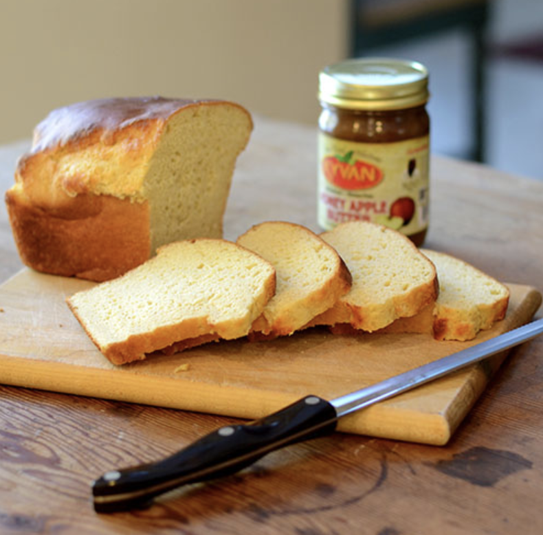

###### *RELATED* : 
---

---
## PREP | COMMENTS

Prep Time 10 minutes
Cook Time 40 minutes
Total Time 50 minutes
Servings 8 people

---
# INGREDIENTS

#### YEAST MIX:

- [ ] 1½ Cup Water or Milk (or Milk Alternative)
- [ ] 4 Tablespoons Honey
- [ ] 2½ teaspoons Dry Active Yeast
    
#### DRY MIX:

- [ ]  3 Cups of [Bob’s Red Mill gluten free flour mix](http://www.bobsredmill.com/gluten-free-all-purpose-baking-flour.html)
- [ ] 1½ teaspoons Xanthan Gum (
- [ ] 4 teaspoons Baking Powder
- [ ] 1 teaspoon Salt
    
#### WET MIX:

- [ ] 2 teaspoons Apple Cider Vinegar or Lemon Juice (I used the cider vinegar)
- [ ] ¼ Cup Olive Oil
- [ ] 2 Large Eggs

---
# INSTRUCTIONS

1. In measuring cup, pour the milk and bring it to a warm temperature – should be warm to the touch but not hot.  Stir in Honey and add Yeast last.  Set-aside & let proof for approx. 10 minutes.
    
2. Combine Dry ingredients in small bowl and mix.
    
3. Combine Wet Mix ingredients in bowl of stand mixer fitted with the paddle attachment.  Mix for only a few seconds.
    
4. Add in the proofed Yeast Mix and mix again for just a few seconds.
    
5. Add the Dry Mix on a low-speed.  Once absorbed, beat on medium-high for approx. 3 minutes.  Dough will be wet and a little sticky.
    
6. Spray your loaf pan with non-stick spray.
    
7. Preheat your oven to 375 degrees.
    
8. Pour the bread mixture into your prepared loaf pan and set in a warm place to proof while the oven is preheating.  Use a spatula to smooth out the loaf.  The loaf will not smooth out itself.
    
9. Let the bread rise to near the top of the loaf pan.  But do not top it out.  If it rises above the loaf pan, it is not sturdy and could fall.  This is true of all gluten-free breads.
    
10. Bake for approx. 30-45 minutes. If the crust is darkening too quickly, you can cover it with foil and return to baking until done. (I did need to tent the bread and I used most of the cooking time).
    
11. Remove loaf pan from the oven and let it cool before slicing

---
## NOTES

---
## TIPS

---
## NUTRITIONS

---
### *EXTRA* :

