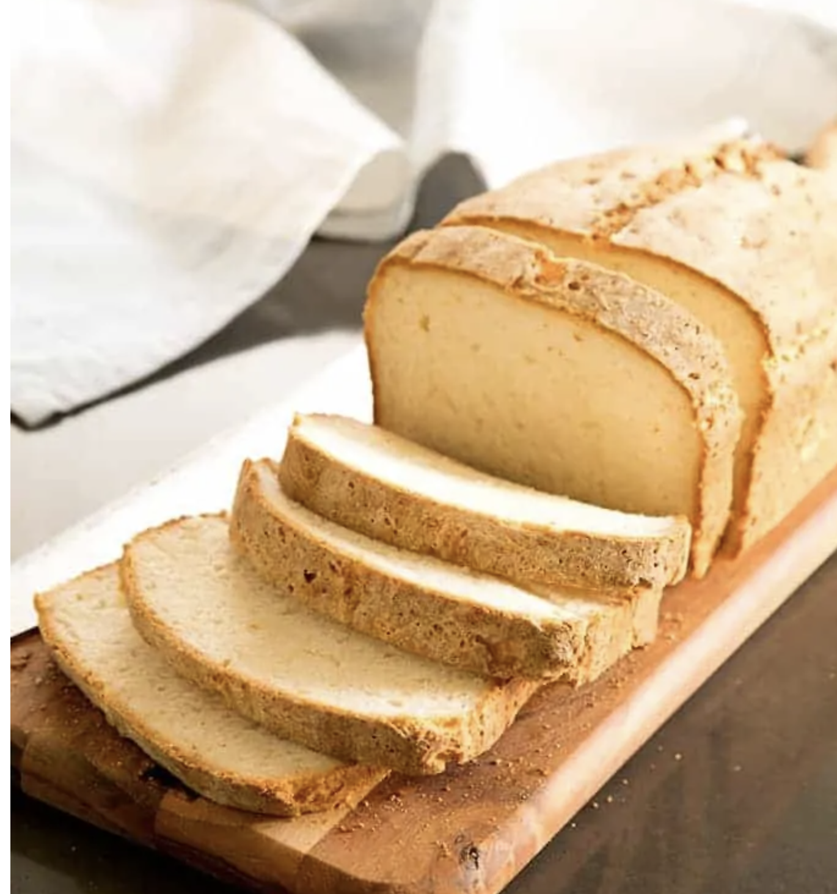

###### *RELATED* : 
---
Get the best gluten free bread recipe for gluten free white sandwich bread. Learn how to make the best gf bread with the original and best recipe.

---
## PREP | COMMENTS

Prep Time:15minutes minutes
Cook Time:1hour hour
Rising time:1hour hour
Total Time:2hours hours 15minutes minutes
Yield: 12  slices bread

---
# INGREDIENTS

- [ ] 3 cups (420 g) **[all purpose gluten free flour](https://glutenfreeonashoestring.com/all-purpose-gluten-free-flour-recipes/)** (I used Better Batter)
- [ ] 2 1/4 teaspoons xanthan gum (omit if your blend already contains it)
- [ ] 2 1/2 teaspoons (8 g) instant yeast
- [ ] 1/4 teaspoon cream of tartar
- [ ] 2 tablespoons (25 g) granulated sugar
- [ ] 2 teaspoons (12 g) kosher salt
- [ ] 1 1/2 cups (12 fluid ounces) warm milk (about 95°F)
- [ ] 4 tablespoons (56 g) unsalted butter, melted and cooled
- [ ] 1 teaspoon apple cider vinegar
- [ ] 2 egg whites (50 g), at room temperature

---
# INSTRUCTIONS

1. Grease or line a 9-inch x 5-inch loaf pan (or slightly smaller) and set it aside.
2. In the bowl of a stand mixer fitted with the paddle attachment, place the flour, xanthan gum, yeast, cream of tartar and sugar. Whisk together with a separate, handheld whisk. Add the salt, and whisk again to combine. Add the milk, butter, vinegar and egg whites, mixing on low speed after each addition. Scrape down the sides of the mixer bowl as necessary during mixing. Turn the mixer to medium-high speed and mix for about 3 minutes. The dough will be thick, smooth and quite wet.
3. Scrape the dough into the prepared loaf pan. Cover the dough with lightly oiled plastic wrap and allow it to rise in a warm, draft-free place for 30 to 45 minutes. It should be overflowing the top of the loaf pan by at least 1/2 inch when you retrieve it but it will not have doubled in volume. It may take longer to rise properly in colder, drier weather and less time in warmer, more humid weather. When the dough has nearly reached the end of its rise, preheat the oven to 375°F.
4. Remove the plastic wrap, using a sharp knife or lame slash the top of the loaf about 1/4-inch deep, and place the pan in the center of the preheated oven. Bake for 45 minutes to 1 hour, or until the internal temperature of the bread reaches about 195°F on an instant-read thermometer. The outside will form a thick, brown crust. Allow to cool for about 10 minutes in the pan before transferring to a wire rack to cool completely. To freeze this bread, cool completely and then slice, wrap tightly, and freeze. Defrost as many slices at a time as you need in the toaster.

---
## NOTES

---
## TIPS

---
## NUTRITIONS

Calories: 237kcal | Carbohydrates: 39g | Protein: 5g | Fat: 6g | Saturated Fat: 4g | Polyunsaturated Fat: 0.2g | Monounsaturated Fat: 2g | Trans Fat: 0.2g | Cholesterol: 16mg | Sodium: 533mg | Potassium: 110mg | Fiber: 3g | Sugar: 4g | Vitamin A: 199IU | Vitamin C: 0.01mg | Calcium: 48mg | Iron: 0.1mg

---
### *EXTRA* :

[From the book **[Gluten-Free on a Shoestring: 125 Easy Recipes for Eating Well on the Cheap Second Edition](http://amzn.to/2xtvcgn)**, by Nicole Hunn. Excerpted by arrangement with Da Capo Lifelong, a member of the Perseus Books, LLC, a subsidiary of Hachette Book Group, Inc. Copyright © 2017.]

