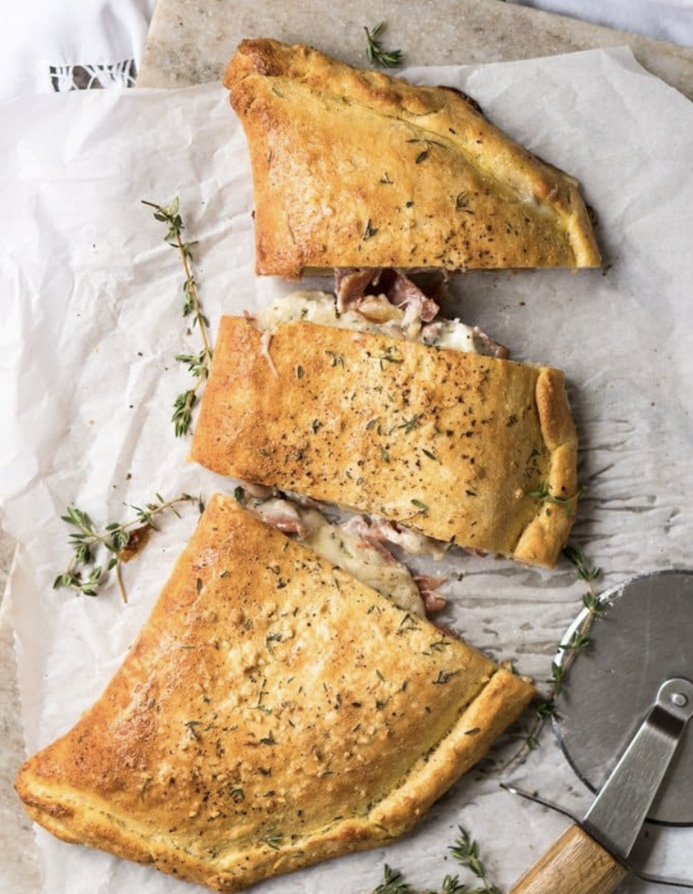

###### *RELATED* : 
---
This gluten free and keto calzone pays **a great homage** to the classic Italian turnovers made with pizza dough. This one, however, uses our (dairy free!) [crazy keto dough](https://www.gnom-gnom.com/keto-dough/) to yield an awesome low carb dish.

---
## PREP | COMMENTS

PREP TIME 15minutes mins
COOK TIME 20minutes mins
TOTAL TIME 35minutes mins

---
# INGREDIENTS

#### For the keto pizza dough:

- [ ] 1 CUP [ALMOND FLOUR](https://amzn.to/2q1v6KO) (if the recipe calls for 2 cups of almond flour or wheat flour, use 1 heaping cup of tapioca flour and one slightly scant cup of coconut flour. That is the magic recipe.
- [ ] Coconut flour absorbs a LOT of liquid, so you have to either combine it with other flours or use 6 eggs for every 1/2 cup of flour.
- [ ] 3 TABLESPOONS[COCONUT FLOUR](http://amzn.to/2f49c8j)
- [ ] 2 TEASPOONS[XANTHAN GUM](https://amzn.to/2uKe4GF)
- [ ] 1 TEASPOON [BAKING POWDER](https://amzn.to/2EfL5K2)
- [ ] 1/4 TEASPOON [KOSHER SALT](https://amzn.to/2uM2LxM)DEPENDING ON WHETHER SWEET OR SAVORY
- [ ] 2 TEASPOONS [APPLE CIDER VINEGAR](https://amzn.to/2GQ1c6E)
- [ ] 1 EGG LIGHTLY BEATEN
- [ ] 5 TEASPOONS WATERAS NEEDED

#### Filling suggestions:

- [ ] 1 cup grated mozzarella cheese *
- [ ] 50 g goat cheese *
- [ ] 50-100 g prosciutto
- [ ] 2 teaspoons fresh thyme or 1 tsp dry
- [ ] 1 clove garlic ran through a press

---
# INSTRUCTIONS

#### FOR THE KETO DOUGH:

1. ADD ALMOND FLOUR, COCONUT FLOUR, XANTHAN GUM, BAKING POWDER AND SALT TO FOOD PROCESSOR. PULSE UNTIL THOROUGHLY COMBINED. 
    
2. POUR IN APPLE CIDER VINEGAR WITH THE FOOD PROCESSOR RUNNING. ONCE IT HAS DISTRIBUTED EVENLY, POUR IN THE EGG. FOLLOWED BY THE WATER, ADDING JUST ENOUGH FOR IT TO COME TOGETHER INTO A BALL. THE DOUGH WILL BE STICKY TO TOUCH FROM THE XANTHAN GUM, BUT STILL STURDY.
    
3. WRAP DOUGH IN CLING FILM AND KNEAD IT THROUGH THE PLASTIC FOR A MINUTE OR TWO. THINK OF IT A BIT LIKE A STRESS BALL. THE DOUGH SHOULD BE SMOOTH AND NOT SIGNIFICANTLY CRACKED (A COUPLE HERE AND THERE ARE FINE). IN WHICH CASE GET IT BACK TO THE FOOD PROCESSOR AND ADD IN MORE WATER 1 TEASPOON AT A TIME. ALLOW DOUGH TO REST FOR 10 MINUTES AT ROOM TEMPERATURE (AND UP TO 5 DAYS IN THE FRIDGE). 
    

#### FOR THE CALZONE

1. PREHEAT OVEN TO 400°F/200°C. LINE A BAKING TRAY WITH A BAKING MAT OR PARCHMENT PAPER.
    
2. TOSS TOGETHER YOUR FILLING CHOICES IN A BOWL. SET ASIDE. 
    
3. ROLL OUT DOUGH BETWEEN TWO SHEETS OF PARCHMENT PAPER WITH A ROLLING PIN. YOU CAN PLAY WITH THICKNESS HERE, BUT WE LIKE TO ROLL IT OUT NICE AND THIN (ROUGHLY 12 INCHES IN DIAMETER). PILE THE TOPPINGS ON TOP OF THE DOUGH, FOLD THE DOUGH IN HALF, PRESS THE EDGES TOGETHER AND FOLD TO SEAL. BRUSH WITH EGG WASH FOR A DEEPER GOLDEN SHEEN (OPTIONAL) AND SPRINKLE SOME THYME (OPTIONAL). 
    
4. PLACE CALZONE IN PREPARED TRAY, BRUSH WITH EGG WASH (OPTIONAL, FOR A GOLDEN SHEEN). BAKE FOR 20-25 MINUTES, UNTIL GOLDEN ALL OVER. SERVE RIGHT AWAY.

---
## NOTES

***If dairy free**, I highly suggest swapping out the cheeses for a generous slather of [our keto pesto](https://www.gnom-gnom.com/paleo-low-carb-keto-pesto/)! Simply whip it up with nutritional yeast instead of parmesan for a suuuuper yum treat. 

Please note that nutrition facts below are estimated for the dough only, per 1 slice (assuming a 6-slice cut up).

---
## TIPS

---
## NUTRITIONS

Serving: 1slice | Calories: 118kcal | Carbohydrates: 5.5g | Protein: 5g | Fat: 9g | Saturated Fat: 1.3g | Cholesterol: 27mg | Sodium: 116mg | Potassium: 10mg | Fiber: 3g | Sugar: 0.8g | Vitamin A: 50IU | Calcium: 38mg | Iron: 0.8mg

---
### *EXTRA* :

