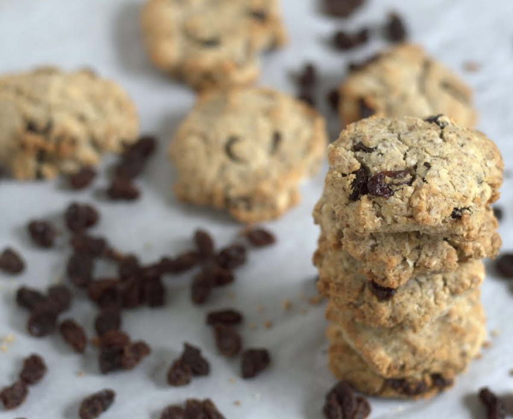

These Paleo Breakfast Cookies are super healthy and easy to make -- Breakfast Cookies that are grain, egg, and dairy-free w/ low carb and nut free options.

## PREP

Prep Time: 10minutes minutes
Cook Time: 18minutes minutes
Total Time: 28minutes minutes

# INGREDIENTS

3 Tbsp ground golden flax seeds (see Recipe Notes for using egg as an alternative) [essai le 2 fév 2019 + 2 c. Tab de chia seeds pour gel, nécessaire?]

9 Tbsp water

2 tsp lemon juice

1/2 tsp vanilla extract (gluten free)

1/4 cup coconut flour

1/2 tsp baking soda

1/2 tsp salt

1 tsp ground cinnamon

3/4 cup unsweetened shredded coconut

1/2 cup chopped raisins (use nuts or coconut for low-carb)

3/4 cup almond butter

3 Tbsp honey (or alternative--see Recipe Notes)

# INSTRUCTIONS

Preheat the oven to 350°F. Line a baking sheet with parchment paper.

In a small bowl, mix the flax seeds, water, lemon juice and vanilla and let it sit for about 10 minutes, until it forms a gel.

In another bowl, whisk the coconut flour with the baking soda, salt, and cinnamon. Add the shredded coconut and raisins and mix until well combined.

Melt the almond butter and sweetener in a saucepan over medium heat. Add the almond butter mixture to the dry ingredients and stir well.

Add the flax gel to the dough and mix until a thick, sticky dough forms. Scoop the cookie dough into 2-inch mounds and place on the prepared baking sheet about 2 inches apart. Repeat until all the dough is used.

Bake for 15 to 18 minutes, until golden brown. Let the cookies cool on a wire rack.

## NUTRITIONS

Serving: 1cookie | Calories: 189kcal | Carbohydrates: 16g | Protein: 5g | Fat: 14g | Saturated Fat: 4g | Sodium: 154mg | Potassium: 213mg | Fiber: 4g | Sugar: 6g | Vitamin C: 1mg | Calcium: 64mg | Iron: 1mg | Net Carbs: 12g

Nutritional information is provided as a courtesy and is merely an approximation. Optional ingredients are not included and when there is an alternative, the primary ingredient is typically used. We cannot guarantee the accuracy of the nutritional information given for any recipe on this site. Erythritol carbs are not included in carb counts since they have been shown not to impact blood sugar. Net carbs are the total carbs minus fiber.

## NOTES

- **For a lower-carb version**: Either omit raisins or substitute either [Homemade Chocolate Chips](https://wholenewmom.com/whole-new-budget/homemade-chocolate-chips-carob-chips-recipe-revised/) or chopped walnuts. See Sweetener Alternatives.
- **For AIP version**: Use gelatin instead of the flax so that you are essentially making a gelatin egg instead of a flax egg. Also use [organic coconut butter](https://www.amazon.com/Artisana-Pure-Organic-Coconut-Butter/dp/B00NAMDECG?tag=whnemo-20) instead of almond butter. This also gives you a nut-free option. For homemade versions of either option, see [Homemade Coconut Butter](https://wholenewmom.com/whole-new-budget/make-your-own-coconut-butter/) and [Homemade Almond Butter](https://wholenewmom.com/recipes/homemade-nut-and-seed-butters/). For the egg, you could also make an AIP version of this [Egg Replacer](https://wholenewmom.com/recipes/energ-egg-substitute-egg-replacer-without-eggs/).
- **Sweetener Alternatives**: Instead of the honey, you can use 1-2 [scoops](https://www.amazon.com/Norpro-Stainless-Measuring-Spoons-smidgen/dp/B0009X1P9S?tag=whnemo-20) [stevia extract powder](https://www.amazon.com/NuNaturals-Nustevia-Stevia-Extract-1-Ounce/dp/B0019LPM0C?tag=whnemo-20).(1/32 - 1/16 teaspoon) See [How to Use Stevia](https://wholenewmom.com/kitchen-tips/stevia-what-it-is-and-how-to-use-it/) for more information. Xylitol or erythritol will also work. [This post](https://wholenewmom.com/whole-new-budget/baking-with-honey-sugar-for-baking/) shows how to substitute granulated for liquid sweeteners, but since there is such a small amount in this recipes, it's most likely not necessary to alter the measurements.
- **Flax Alternative**: The flax seeds in the recipe function as an egg as you can see in

## TIPS

