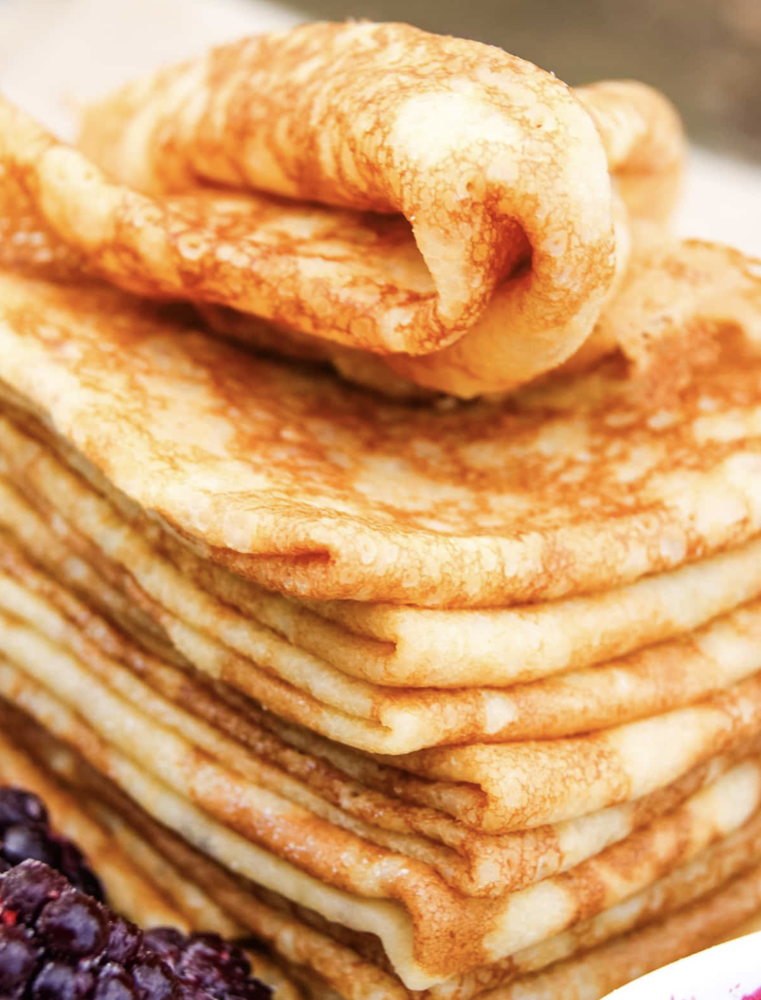

###### *RELATED* : 
---

---
## PREP

Prep Time 15 minutes

Cook Time 45 minutes

Total Time 1 hour
  
Servings 24 crepes

---
# INGREDIENTS

- [ ] 3 medium eggs room temperature
- [ ] 4 tablespoon melted butter
- [ ] 1 teaspoon honey
- [ ] 1/2 teaspoon fine sea salt
- [ ] 3/4 cup cassava flour
- [ ] 2 cup milk of your choice, divided (plus more as needed)
- [ ] additional butter for frying

---
# INSTRUCTIONS

- [ ] Combine all ingredients using only 1 cup of milk in a blender and blend for 1 minute or until thoroughly combined.

- [ ] Add remaining milk and blend for another 30 seconds. 

- [ ] Strain the batter through a sieve to remove clumps of flour, use a rubber spatula to help the batter run through the sieve.
- [ ] Heat a lightly buttered stainless steel over medium heat.
- [ ] Pour 1/4 cup of the batter onto the pan and tilt it with a circular motion so that the batter coats the surface evenly.
- [ ] Cook the crêpe for about a minute, until the bottom is light brown and can easily be loosened with a thin metal spatula.
- [ ] Turn the crêpe and cook the other side.

---
## NUTRITIONS

Calories: 102kcal | Carbohydrates: 9g | Protein: 3g | Fat: 6g | Saturated Fat: 3g | Polyunsaturated Fat: 0.4g | Monounsaturated Fat: 2g | Trans Fat: 0.2g | Cholesterol: 56mg | Sodium: 129mg | Potassium: 79mg | Fiber: 0.2g | Sugar: 3g | Vitamin A: 242IU | Vitamin C: 0.4mg | Calcium: 69mg | Iron: 1mg

---
## NOTES

First crepe (or two) may not always turn out perfectly. It is totally appropriate that you do a taste test to make sure they are good and continue with the rest.You may need to butter the pan every so often (after 3-4 crepes). Simply add 1/4 teaspoon of butter onto the pan and swirl to be sure there's a good amount of fat covering the pan.Use a measuring cup to deliver just enough batter onto the pan (1/4 cup works perfectly!).Be sure to stir the batter every so often as flour settles on the bottom, changing the consistency of it. You may need to add a few tablespoons of additional milk as you come towards the end of your batter supply. Toppings include: fruit, jams, jellies, sour cream, cheese, spinach and other greens, butter and salmon roe, cured salmon, etc.

---
## TIPS

**_Pro tip:_** To help faciliate proper blending, add the ingredients in this order: milk, eggs, butter, honey, flour, and salt.

**Practice makes perfect** - Don't be discouraged if the first few crepes don't turn out perfectly. In fact, it is customary and totally appropriate for the cook to eat the first few.

**Preheat the pan** - A properly heated pan ensures that the crepes cook evenly and quickly. Preheat the pan first on medium heat then melt the butter.

**Measure with a measuring cup** - Use a ¼-cup measuring to deliver just the right amount of batter.

**Use a crepe spreader** - Though not necessary, this tool will help you easily distribute the batter in the pan to achieve thin and uniform crepes.

**Watch the crepes closely** - Be attentive while cooking the crepes as they cook quickly. Avoid leaving the pan unattended to prevent burning.

**Stir the batter often** - Be sure to stir often as flour settles on the bottom, changing the consistency of it. You may need to add a few tablespoons of milk to thin it out as you get low on the batter.

---
### *EXTRA* :

