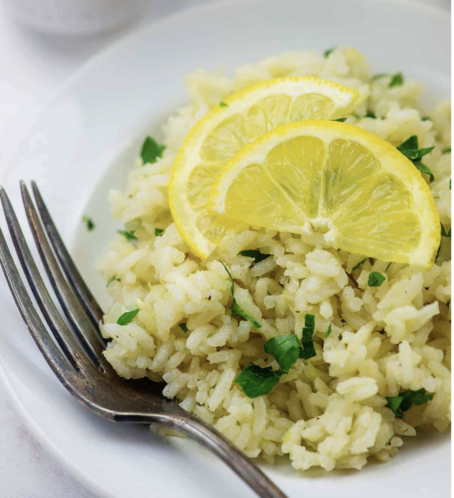

###### *RELATED* : 
---
This Greek rice recipe just needs about 5 minutes of hands on time and it turns out so fresh and flavorful, thanks to the lemon and fresh herbs. We serve this up often and it's a huge hit with my family.

---
## PREP | COMMENTS

PREP 5minutes minutes
COOK 20minutes minutes
TOTAL 35minutes minutes

---
# INGREDIENTS

- [ ] 1 teaspoon olive oil
- [ ] 2 cups long grain white rice
- [ ] ½ medium onion minced
- [ ] 2 cloves garlic minced
- [ ] 4 cups [chicken broth](https://amzn.to/2KLhzp8)
- [ ] 1 tablespoon Greek seasoning
- [ ] 1 lemon
- [ ] 2 tablespoons minced parsley

---
# INSTRUCTIONS

1. Heat the oil in a large sauce pan over medium heat.
2. Once hot, add the rice, onion, and garlic and cook, stirring often, until the rice is lightly golden at the tips and the onions have softened.
3. Add the chicken broth and Greek seasoning to the pot and stir to combine. Bring to a boil, reduce to a simmer, cover, and cook for 15 minutes over medium low heat.
4. Turn off the heat and let the pan set, covered, for 10 minutes.
5. Remove the lid from the pan and fluff rice with a fork.
6. Use a microplane grater to zest the lemon and add to the rice. Cut the lemon in half and squeeze the lemon juice into the rice. Add the parsley and stir.
7. Serve hot.

---
## NOTES

This recipe is easily halved, but we like having the leftovers on hand to pull out on busy nights. 

Fresh or dried dill is also delicious stirred in with the parsley.

---
## TIPS

---
## NUTRITIONS

Serving: 0.5cup| Calories: 125kcal (6%)| Carbohydrates: 26g (9%)| Protein: 3g (6%)| Fat: 1g (2%)| Saturated Fat: 1g (6%)| Sodium: 289mg (13%)| Potassium: 121mg (3%)| Fiber: 1g (4%)| Sugar: 1g (1%)| Vitamin A: 56IU (1%)| Vitamin C: 12mg (15%)| Calcium: 19mg (2%)| Iron: 1mg (6%)

---
### *EXTRA* :

