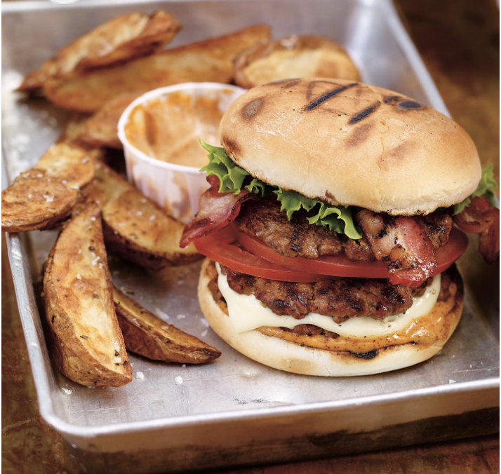

## PREP

# INGREDIENTS

## Seasoning

### **Per 3 lbs of beef**:

1.13 tablespoon salt

3/4 tablespoon paprika

1.13 teaspoon dry mustard

1.13 teaspoon ground pepper

1.13 teaspoon onion powder

.56 teaspoon garlic powder

.56 teaspoon celery salt (we use celery seeds)

  

### **Per 4 lbs of ground beef:**

1 1/2 tablespoon  salt

1 tablespoon paprika

1 1/2 teaspoon dry mustard

1 1/2 teaspoon ground pepper

1 1/2 teaspoon onion powder

3/4 teaspoon garlic powder

3/4 teaspoon celery salt (we use celery seeds)

- ### Spicy mayonnaise
    
    - [1/2 cup (125 ml) mayonnaise](https://www.ricardocuisine.com/en/recipes/7165-homemade-mayonnaise)
    - 2 tsp chili powder
    - 2 tsp (10 ml) Dijon mustard
- ### Hamburgers
    
    - 1 1/2 lb (675 g) lean ground beef
    - 8 slices bacon 

    - 4 slices mozzarella cheese 

    - 4 hamburger buns 

    - 1 tomato, cut into thin slices 

    - 4 lettuce leaves

# INSTRUCTIONS

- ### Seasoning
    
    - In a bowl, combine all of the ingredients. Set aside. 


- ### Spicy mayonnaise
    
    - In another bowl, combine all of the ingredients. Refrigerate until ready to serve.
        
- ### Hamburgers
    
    - Preheat the grill, setting the burners to high. Oil the grate.
        
    - Using your hands or a hamburger press, shape the ground beef into twelve very thin hamburger patties.
        
    - Grill the bacon until crisp, about 2 to 3 minutes on each side. Grill the burgers for 3 minutes on each side or until cooked through. Sprinkle with the seasoning mixture. Reserve any remaining seasoning for another use (see note). One minute before the meat is done cooking, place the cheese slices on four patties. Toast the buns.

- ### Assembly
    
    - Spread the spicy mayonnaise on the buns. Place the cheese-topped patties on the bun bottoms. Top with one plain patty and tomato slices. Add the remaining patties. Top with slices of bacon and lettuce. Cover with the bun tops.

## NUTRITIONS

## NOTES

Use the leftover seasoning on pork chops or chicken.

## TIPS

### *EXTRA*

