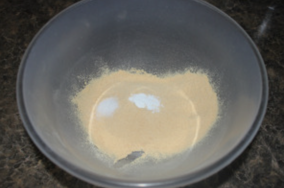
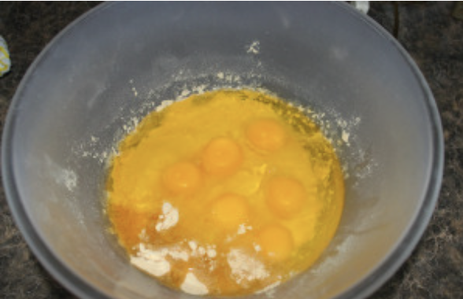
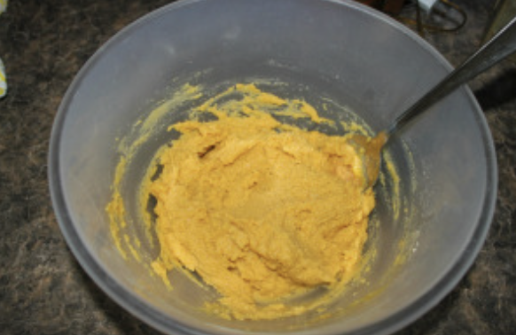
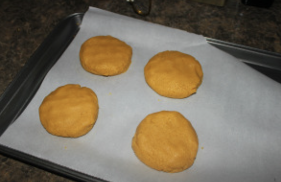
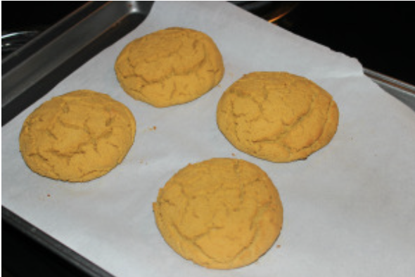

###### *RELATED* : 
---

---
## PREP | COMMENTS

---
# INGREDIENTS

- [ ] 3/4 cup coconut flour (**essai avec 1/2 t. 1/3 t. De farine de tournesol et le reste de farine de noix de coco mais est devenu vert!)**
- [ ] 1/2 tsp. baking soda
- [ ] 1/2 tsp. sea salt
- [ ] 6 eggs
- [ ] 1/2 cup olive oil (huile d’avocados)
- [ ] 1 Tbsp. water
- [ ] Ajout 1 c. Tab miel

---
# INSTRUCTIONS

1. Preheat the oven to 325 degrees.  Add coconut flour, baking soda, and sea salt to a medium mixing bowl.

2. Add the eggs, olive oil, and water to the dry ingredients.

3. Mix well and let sit for about 5 minutes. (This will allow for the coconut flour to really soak up the wet ingredients.

4.  Divide the dough into 4-5 equal parts (4 for larger buns and 5 for smaller buns).  Form a bun shapes from the dough and place on a baking sheet lined with parchment paper.

5. Bake in the oven for 30 minutes at 325 degrees.

6. Using a knife, slice the buns in half horizontally.

---
## NOTES

If you want, you can also add some spices or seeds to this for more flavor in your buns, or if you want a little sweetness to them, you can add a bit of stevia or honey, but this is the basic recipe.

---
## TIPS

---
## NUTRITIONS

---
### *EXTRA* :

