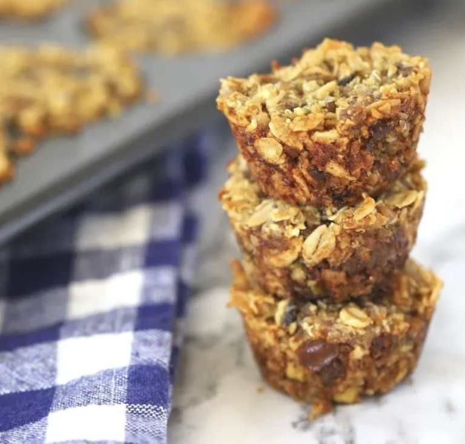

###### *RELATED* : 
---
Loaded Homemade Aussie bites are a copycat recipe that take the Costco favorite and makes a gluten free version filled with your favorite dried fruits and nuts. Whole grains of oats and quinoa are the base of these energy bites. Apricots, dried cherries, raisins and pistachios add to the flavor.

---
## PREP | COMMENTS

**PREP TIME**10 minutes
**COOK TIME**14 minutes
**TOTAL TIME**24 minutes

---
# INGREDIENTS

- [ ] 2 cups gluten free oats (separated into 1 cup portions)
- [ ] 1 cup cooked quinoa (gluten free)
- [ ] 1/4 cup dried apricots
- [ ] 1/4 cup dried cherries
- [ ] 1/2 cup pitted dates
- [ ] 1/4 cup raisins
- [ ] 1/4 cup honey
- [ ] 1/4 cup pistachios
- [ ] 1/2 cup coconut flakes
- [ ] 3 tablespoons unsalted butter, melted
- [ ] 1 teaspoon baking soda

#### Other suggestions you might consider:

 - [ ] sunflower seeds
 - [ ] chia seeds
 - [ ] vanilla extract
 - [ ] walnuts

---
# INSTRUCTIONS

1. Preheat the oven to 350 degrees F. Spray a mini muffin tin with baking spray (optional)
2. Use a food processor to process 1 cup of the oats until consistency is like flour. Pour into a medium size bowl. Add the remaining cup of oats and the quinoa. Stir to combine.
3. No need to clean the food processor. Add the apricots, dried cherries, dates, and raisins. Pulse to break down the fruits into tiny pieces. Going all the way to a smooth paste is fine too. Add the oats and quinoa and back into the food processor.
4. Add the honey, coconut flakes, pistachios, melted butter, and baking soda. Pulse until the mixture comes together. It will likely form a ball.
5. Place about 1 tablespoon of the mixture into each mini muffin space. Press down to fill the muffin cavity.
6. Bake for 12-14 minutes or until the edges start to brown.
7. Let cool in the muffin tin completely before removing.

---
## NOTES

Customize the ingredients to make these fit your preferences and diet requirements.

---
## TIPS

---
## NUTRITIONS

_Amount Per Serving:_ CALORIES: 83TOTAL FAT: 3gSATURATED FAT: 2gTRANS FAT: 0gUNSATURATED FAT: 1gCHOLESTEROL: 4mgSODIUM: 65mgCARBOHYDRATES: 14gFIBER: 1gSUGAR: 8gPROTEIN: 1g

---
### *EXTRA* :

