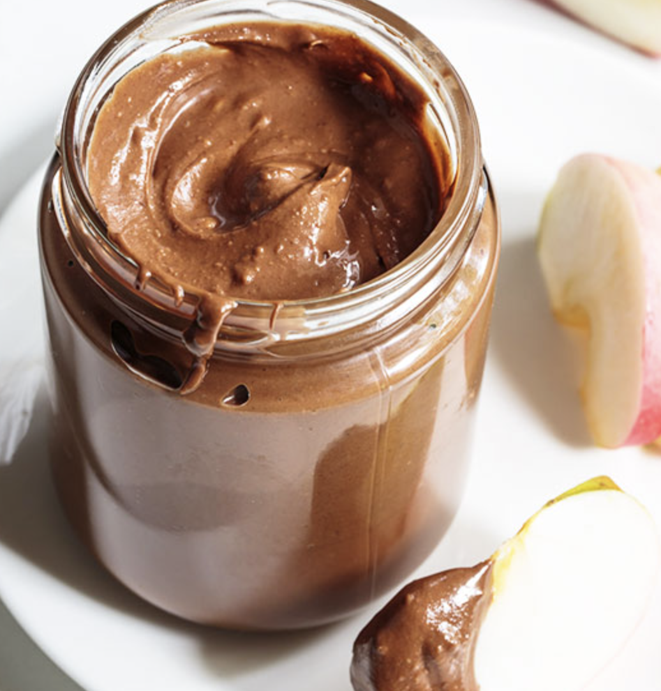

###### *RELATED* : 
---
When I first found this recipe for Homemade Nutella, I knew just who my first jar would go to.

---
## PREP | COMMENTS

---
# INGREDIENTS

- [ ] 2/3 cup hazelnuts
- [ ] ¼ teaspoon salt
- [ ] 1 cup cacao powder
- [ ] ½ cup coconut oil
- [ ] 1/3 cup + 1 tablespoon maple syrup

---
# INSTRUCTIONS

1. Soak the hazelnuts in water overnight, then drain and rinse well.
2. Put hazelnuts in a high speed blender or food processor and blend until smooth, then add salt and pulse to combine. Add cocoa powder and coconut oil and blend to combine. If necessary scrape down sides of the jar. Add maple syrup and blend to form a paste. If by any chance the mixture separates, add warm water, 1 tablespoon at a time, while blender is running to bring the mixture back together.
3. Place the Nutella in a jar and store in a refrigerator for two weeks. Serve with apple slices as a snack.

---
## NOTES

---
## TIPS

---
## NUTRITIONS

---
### *EXTRA* :

