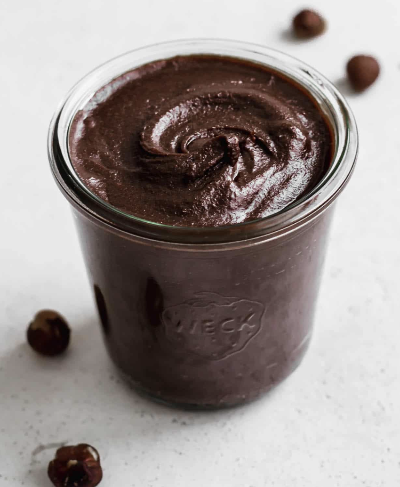

###### *RELATED* : 
---
This Homemade Vegan Nutella is the best healthy Nutella alternative made with 5 simple ingredients. It’s also dairy-free, gluten-free, paleo, and refined-sugar-free!

---
## PREP | COMMENTS

-  prep time: 10 MINS
 -  cook time: 0 MINUTES
 -  total time: 10 MINS

---
# INGREDIENTS

- [ ] 1 1/2 cups plain unsalted [hazelnuts](https://www.amazon.com/gp/product/B00XEW6PSC/ref=as_li_qf_asin_il_tl?ie=UTF8&tag=choosingchia-20&creative=9325&linkCode=as2&creativeASIN=B00XEW6PSC&linkId=711acbab8d8b1d17c08ba401397f087b)
- [ ] 4 oz [70% dark chocolate](https://www.amazon.com/gp/product/B000LKV7Q0/ref=as_li_qf_asin_il_tl?ie=UTF8&tag=choosingchia-20&creative=9325&linkCode=as2&creativeASIN=B000LKV7Q0&linkId=b50eb01e8564557290167ebc07e35651)
- [ ] 1/4 cup refined [coconut oil](https://www.amazon.com/gp/product/B00DS842HS/ref=as_li_qf_asin_il_tl?ie=UTF8&tag=choosingchia-20&creative=9325&linkCode=as2&creativeASIN=B00DS842HS&linkId=5c53f6cde44b7f964e3f8e49d5952b8e)
- [ ] 1/4 cup [maple syrup](https://www.amazon.com/gp/product/B00A2N74T0/ref=as_li_qf_asin_il_tl?ie=UTF8&tag=choosingchia-20&creative=9325&linkCode=as2&creativeASIN=B00A2N74T0&linkId=48f22e7314552baaea69cdc238ceed62)
- [ ] 1/4 tsp salt

---
# INSTRUCTIONS

1. Preheat the oven to 350 degrees F. Place the hazelnuts on a baking sheet and toast for 10 minutes, or until lightly coloured.
2. Remove from oven and let cool.
3. Place the hazelnuts in the center of a kitchen hand towel and close all 4 edges to make a pouch. Use your hands to rub the hazelnuts in the towel to remove the skins. (This will be much quicker than doing them all individually by hand.)
4. Once the skins are removed, place the hazelnuts in a  food processor and blend until they start to turn into hazelnut butter. (This should take 2-3 minutes.)
5. Next, melt the dark chocolate in a bowl with coconut oil in the microwave.
6. Add the melted chocolate, maple syrup and salt to the food processor and puree for 3-4 minutes until smooth and creamy.
7. Store in a jar in the pantry for up to 2 weeks. The Nutella can also be stored in the fridge for 2 months, but it will become quite hard and need to be thawed before using.

---
## NOTES

Make sure to use unsalted hazelnuts.

No chocolate? Use cocoa powder. If you don’t have any dark chocolate on hand, you can substitute it with 1/3 cup of cocoa powder.

Blend the Nutella long enough. The longer you blend it together the smoother it will become. It helps to have a powerful blender or food processor to help make it creamy.

---
## TIPS

- **Make sure to use unsalted raw hazelnuts**. You can use hazelnuts that have their skins on and remove them, (as shown in the recipe) or you can buy hazelnuts with the skins already removed. Most roasted hazelnuts are salted and have oil added to them, which is why it’s best to stick to raw for this recipe.

- **Roast the hazelnuts**. This is an important part of the recipe to build flavour! Roasting the hazelnuts is what gives the nutella that signature taste.

- **Use dark chocolate for a rich chocolatey taste**. 70% or higher I find are best for this recipe.

- **No chocolate? Use cocoa powder**. If you don’t have any dark chocolate on hand, you can substitute it with 1/3 cup of cocoa powder. Just melt the coconut oil and add the cocoa powder and coconut oil to the food processor.

- **Blend the Nutella long enough**. The longer you blend it together the smoother it will become. It helps to have a powerful blender or food processor to help make it creamy.

---
## NUTRITIONS

- **serving size:** 1 tbsp
- **calories:** 100
- **sugar:** 4.6g
- **fat:** 8.5g
- **saturated fat:** 3.2g
- **carbohydrates:** 6g
- **fiber:** 1g
- **protein:** 1.8g

---
### *EXTRA* :

