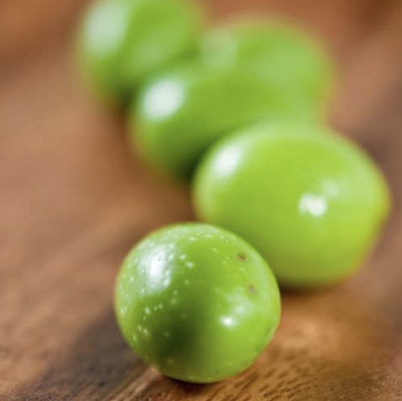

###### *RELATED* : 
---
This is a long-term, brine cure for green olives. It is very traditional and only requires time and a cool place, under 75°F. Know that olives started in fall are not normally ready until spring. Mold is normal. Skim it off.

---
## PREP | COMMENTS

---
# INGREDIENTS

- [ ] - 4 pounds fresh green olives
- [ ] 1 cup kosher salt
- [ ] 1 gallon water
- [ ] 1 cup distilled vinegar

---
# INSTRUCTIONS

1. Assuming you've already checked your olives for worm scars (see headnotes), discard any with too many blemishes. Place the olives in a stoneware crock or large glass jar with a lid carefully. Fresh olives actually do bruise easily.
2. Mix the vinegar, salt and water together. No need to boil, as it will dissolve at room temperature. Pour this over the olives, making sure they are submerged by at least 2 inches. Add more brine in the same ratio if need be.
3. Chances are the olives will float. You need to keep them away from air, so I put a plate over them that is just about the size of the jar or crock. You can also use a plastic bag filled with water to keep the olives away from air. Once the olives are submerged, cover the jar or lid (lightly screw on the top if there is one) and place the container in a cool, dark place. A basement is ideal. You don't want them to ever get beyond 75°F if you can help it, because at higher temperatures the olives can go soft. Since this is a wintertime cure, it should not be a problem. Low temperatures are fine, just don't let them freeze. Let them sit for several months.
4. As time passes, you will see a scum of mold and weirdness form on the top. This is normal. Skim it off once a week and you'll be fine. At some point the brine itself will get pretty icky. I like to change the brine every month or so, but this is not strictly needed. The olives are done when they are no longer bitter, anywhere from 2 to 4 months.
5. Only now do you add other seasonings, like chile peppers, black peppercorns, herbs or citrus peel. Do this in a fresh brine, and let this new, flavorful brine sit 2 weeks before serving. Store the olives in this brine, in a cool place or refrigerator, for up to 2 years. I keep them in quart Mason jars.

---
## NOTES

#### FLAVOR ADDITIONS

- dried chiles
- bay leaves or similar aromatic leaves like citrus leaves
- thyme, sage, oregano, rosemary 
- allspice, black peppercorns, juniper berries
- smashed garlic cloves

---
## TIPS

---
## NUTRITIONS

Calories: 132kcal | Carbohydrates: 3g | Protein: 1g | Fat: 14g | Saturated Fat: 2g | Sodium: 1412mg | Potassium: 38mg | Fiber: 3g | Sugar: 1g | Vitamin A: 357IU | Calcium: 47mg | Iron: 1mg

---
### *EXTRA* :

