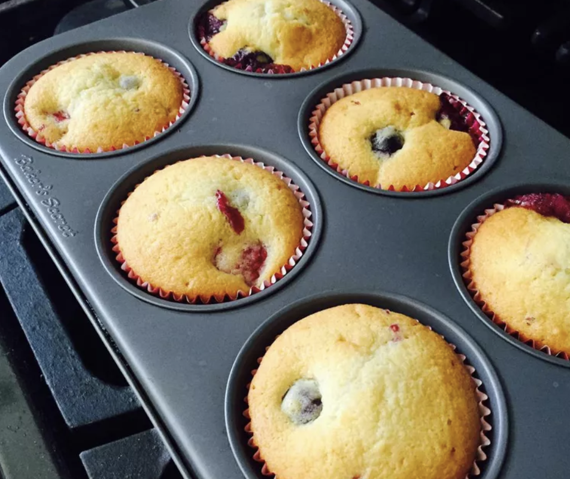
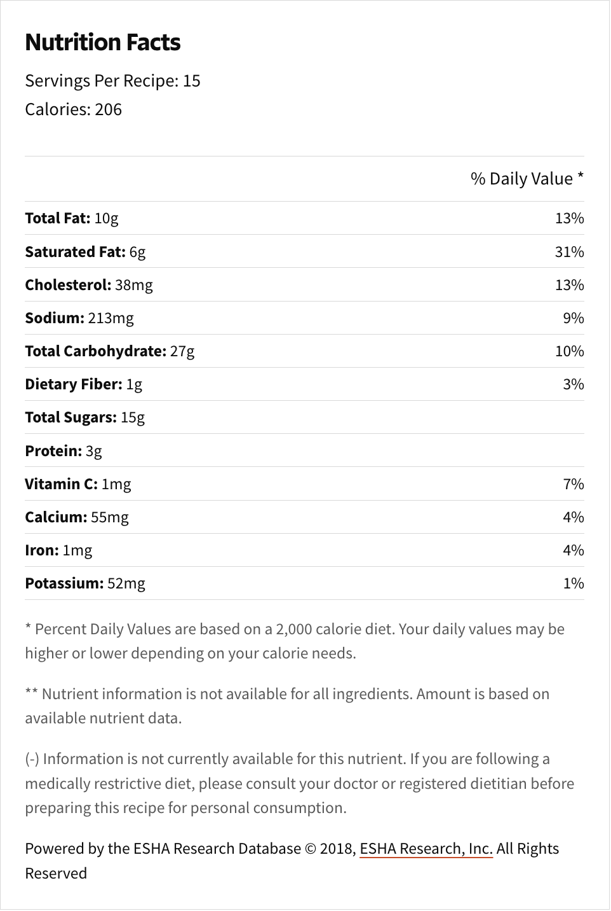

###### *RELATED* : 
---
Huckleberries are a hard-to-find, delicious treat, and finding recipes that use them can be even harder. I came up with this recipe for huckleberry muffins as a variation of my favorite blueberry muffin recipe, and they truly are delicious! If you can't find huckleberries, blueberries work well.

---
## PREP | COMMENTS

Prep Time:15 mins
Cook Time:15 mins
Total Time:30 mins

---
# INGREDIENTS

- [ ] 1 cup white sugar
- [ ] ¾ cup butter
- [ ] ¾ cup milk
- [ ] 1 large egg
- [ ] 1 teaspoon vanilla extract
- [ ] 1 ¾ cups sifted all-purpose flour
- [ ] 2 ½ teaspoons baking powder
- [ ] ½ teaspoon salt
- [ ] 1 cup huckleberries
- [ ] 1 tablespoon all-purpose flour

---
# INSTRUCTIONS

1. Preheat the oven to 400 degrees F (200 degrees C). Grease 15 muffin cups or line with muffin papers.
    
2. In a large bowl, cream together sugar and butter until smooth. Mix in milk, egg, and vanilla until well blended. Combine 1 3/4 cups flour, baking powder, and salt; stir into batter until just moistened. Toss huckleberries with 1 tablespoon flour to coat, then fold them into batter. Spoon batter into muffin cups, filling at least 2/3 full.
    
3. Bake for 15 minutes in the preheated oven, or until the tops spring back when lightly pressed.

---
## NOTES

---
## TIPS

---
## NUTRITIONS

---
### *EXTRA* :

