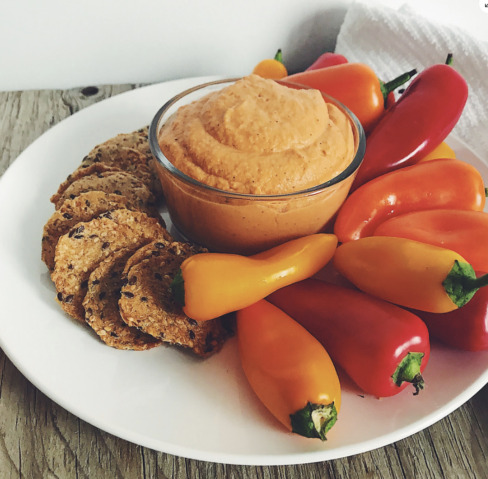

###### *RELATED* : 
---

---
## PREP | COMMENTS

Temps de préparation | 25 minutes
Cuisson | 45 minutes
Se conserve 1 semaine au frigo

---
# INGREDIENTS

#### **Poivron rôti**

- [ ] 1 poivron rouge (ou orange) [Ne pas en mettre ou en mettre la moitié]
- [ ] Huile d'olive, pour badigeonner [non]
- [ ] Sel et poivre, au goût [non]
- [ ] **Oignon caramélisé**
- [ ] 1 oignon jaune moyen
- [ ] 1 gousse d'ail
- [ ] 1 c. à thé (5 ml) d'huile d'olive
- [ ] 1 c. à thé (5 ml) de beurre vegan
- [ ] 1 c. à thé (5 ml) de vinaigre balsamique
- [ ] 1 c. à thé (5 ml) de sirop d'érable
- [ ] 1 ou 2 pincées de sel, au goût
    
#### **Hummus**

- [ ] 1 boîte de conserve de pois chiches (540ml, 19 oz)
- [ ] 2 c. à table (15 ml) de tahini (pâte de sésame)
- [ ] 2 c. à table (15 ml) de jus de citron [3]
- [ ] ½ c. à thé (2,5 ml) de sel [plus]
- [ ] Poivre, au goût
- [ ] 1 poivron rôti (voir étapes ci-bas)
- [ ] 1 oignon caramélisé (voir étapes ci-bas)
- [ ] [Ajout de 1c. tab vinaigre de cidre]
- [ ] [Ajout de 1 c. tab levure nutritionelle]

---
# INSTRUCTIONS

Cette délicieuse recette se fait en 3 étapes faciles.

#### **Premièrement, faite rôtir le poivron.**

1. Préchauffer le four à 400 F (205 C).
    
2. Bien laver le poivron, le couper en deux, retirer la tige et les grains à l'intérieur.
    
3. Badigeonner le poivron avec de l'huile d'olive.
    
4. Saler et poivrer au goût.
    
5. Déposer sur une plaque à biscuit un papier parchemin et y déposer le poivron, l'intérieur face contre la plaque.
    
6. Cuire au four 20 à 25 minutes ou jusqu’à ce que le poivron soit bien rôti et cuit.
    
7. Retirer du four et laisser refroidir pendant la préparation de l’oignon caramélisé.
    
8. Une fois froid, retirer la peau du poivron.
    
9. Mettre le poivron dans le robot culinaire.
    

#### **Deuxièmement, préparer l'oignon caramélisé.**

  

1. Couper l'oignon et émincez-le en fines lamelles de la même dimension.
    
2. Presser l'ail dans le presse-ail.
    
3. Dans une poêle à feu doux/moyen, faire revenir pendant 5 minutes dans l’huile et le beurre les oignons et l’ail.
    
4. Ajouter le sel, le vinaigre et le sirop d'érable.
    
5. Laisser cuire de 10 à 15 minutes ou jusqu'à tendreté, en remuant à l'occasion.
    
6. Éteindre le feu et laisser refroidir.
    
7. Une fois froid, transférer les oignons dans le robot culinaire.

#### **Troisièmement, ajoutez les autres ingrédients pour terminer le hummus.**

1. Égoutter l'eau des pois chiches*.
    
2. Ajouter les pois chiches au robot culinaire (avec le poivron et les oignons caramélisés).
    
3. Mélanger à vitesse maximale pendant environ 5 minutes, ou selon la consistance désirée.
    
4. Verser dans un bol avec couvercle et laisser au frigo au moins 1 heure avant de servir.

---
## NOTES

---
## TIPS

---
## NUTRITIONS

---
### *EXTRA* :

