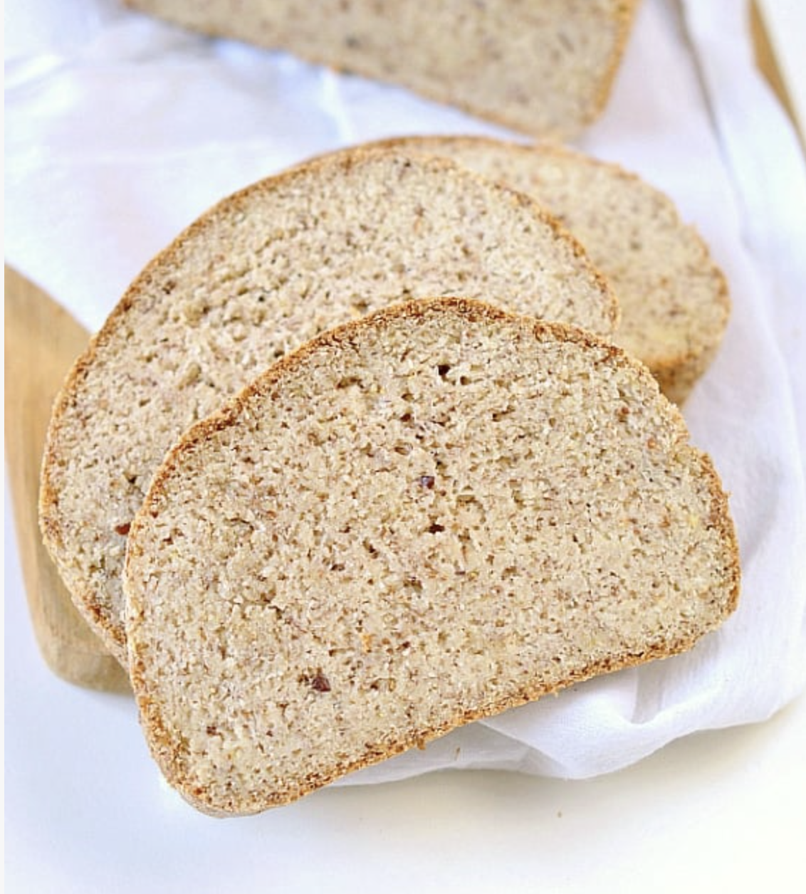
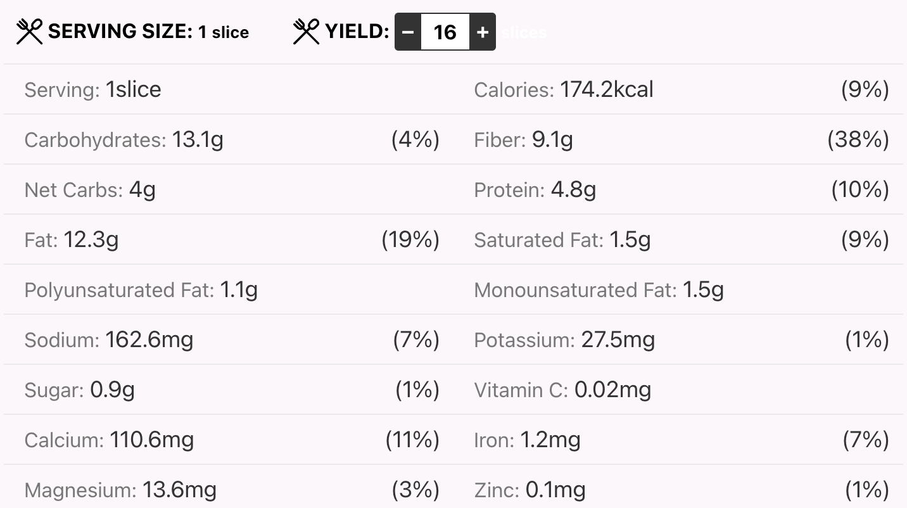

###### *RELATED* : 
---

---
## PREP | COMMENTS

PREP TIME:15 MINS
COOK TIME:55 MINS
TOTAL TIME: 1 HR 10 MINS
16 SLICES

---
# INGREDIENTS

#### DRY INGREDIENTS

- [ ] 300 g blanched almond flour not almond meal! (10.6 oz, 2 1/2 cup)
- [ ] 60 g coconut flour (2.1 oz, 1/2 cup)
- [ ] 40 g flaxmeal (1.4 oz, 1/3 cup)
- [ ] 40 g ground psyllium husk (1.4 oz, 1/3 cup + 2 tablespoon)
- [ ] 1 tablespoon baking powder
- [ ] 7 g salt

#### WET INGREDIENTS

- [ ] 30 ml olive oil (2 tablespoons)
- [ ] 10 ml apple cider vinegar (1 teaspoon)
- [ ] 480 ml lukewarm water - thick bath temperature, 40C (2 cups)

---
# INSTRUCTIONS

1.  Preheat oven to 200C (400F). Line a loaf pan 9 inches x 5 inches with a piece of parchment paper. Slightly oil the paper to make sure the bread don't stick to the pan. Set aside.
2. In a large mixing bowl, add all the dry ingredients, whisk to combine. 
3. Add the liquid ingredients, order doesn't matter. Combine with a spatula or spoon then use your hand to knead the dough for about 1-2 minutes The batter is very moist at first, getting dryer as you go. After 2 minutes, it should come together easily to form a dough. If not, too sticky, add more husk, 1/2 teaspoon at a time, knead for 30 sec and see how it goes. The dough will always be a bit moist, but it shouldn't stick to your hands at all. If so, the bread will be too moist when baked. 
4. Set aside 10 minutes to let the fiber fully absorb the liquid. 
5. Shape the dough as you want your bread to look like when baked. I mean you want a lovely round bun on top of your loaf so shape a cylinder of dough that match the length of the pan,  but DO NOT press/ flatten the top of your loaf or you will end up with a more dense/tight crumb. Keep the top round shape, it is what will create a bread loaf that is soft and light with holes in the crumb.
6. Slightly rub your hand with water and massage the surface of the bread to remove any holes and create a smooth surface. 
7. Bake for 50-55 minutes in the center of the oven, fan-bake mode is the best. 
8. After 50 minutes, prick the center of the loaf with a skewer to test. If it comes out clean, it is cooked. If not, it means the bread is still wet inside, cover the loaf pan with a piece of foil, reduce heat to 180C (375F), and keep baking for 20-30 minutes until cooked in the middle. 
9. Lift the bread out of the pan using the parchment paper.
10. Fully cool down on a rack before slicing - at least 3 hours for best result.
11. Slice into 16 slices. Store in the fridge up to 5 days or freeze up to 3 months, in airtight containers.

---
## NOTES

---
## TIPS

---
## NUTRITIONS

---
### *EXTRA* :

