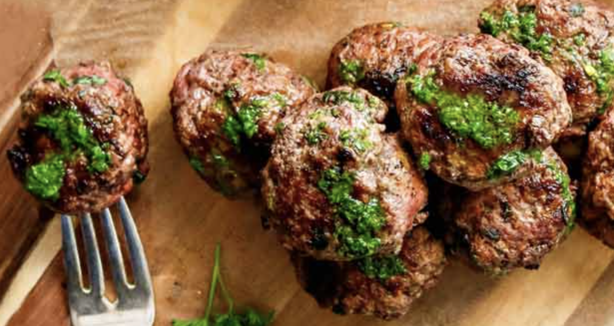

## PREP

# INGREDIENTS

##### **For the meatballs**

•    1 pound 93 percent lean ground grass fed beef

•    1/3 cup finely chopped organic cilantro

•    1/2 teaspoon minced garlic

•    1/2 teaspoon dried oregano

•    1/4 teaspoon sea salt

##### **For the chimichurri sauce**

•    1/3 cup avocado oil (plus 2 tablespoons for frying meatballs)

•    1/2 cup chopped curly parsley

•    1/4 cup chopped cilantro

•    2 tablespoons apple cider vinegar

•    1/2 teaspoon dried oregano

•    1/8 teaspoon sea salt

•    1/4 teaspoon red pepper flakes

# INSTRUCTIONS

### For the meatballs:

1. Combine ingredients for meatballs in a medium mixing bowl and use your hands to thoroughly mix. Form into golf ball-sized meatballs.

Dernière fois cuites au four à 425F pour 20 mimutes mais étaient trop cuites donc essayer moins longtemps la prochaine fois.

2. Heat 2 tablespoons avocado oil in a 10-inch cast iron pan over medium heat for two minutes. Place five meatballs in pan at a time and cook for 15 minutes, rotating them every four minutes. Repeat with the remaining meatballs.

3. Serve the meatballs hot topped with chimichurri sauce.

  
### For the chimichurri sauce:

1. While the meatballs cook, combine the ingredients for the chimichurri sauce in a food processor or blender.
2. Blend until thoroughly combined.

## NUTRITIONS

## NOTES

## TIPS

### *EXTRA*

