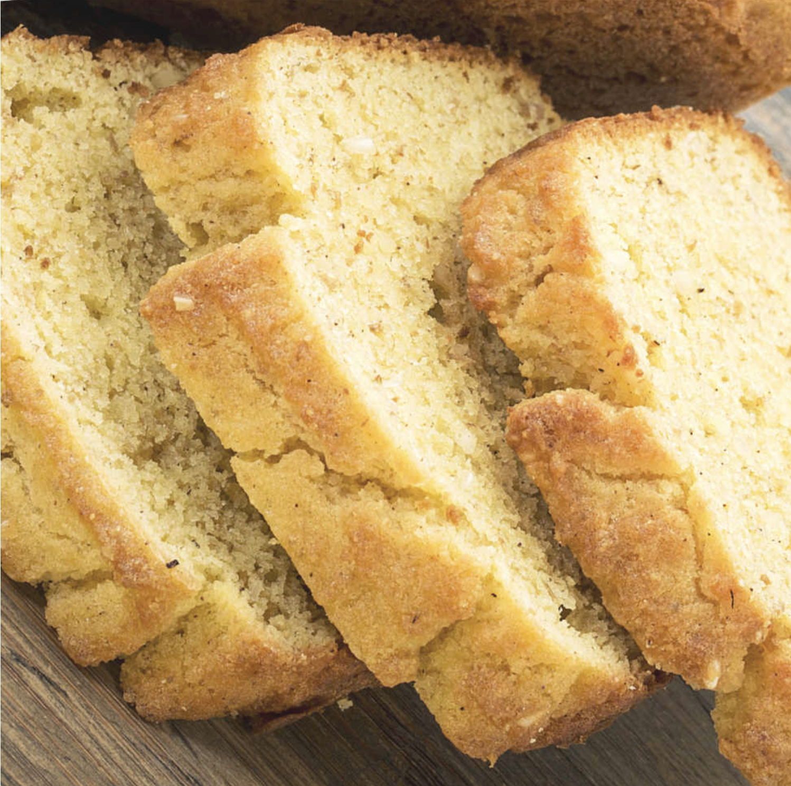

###### *RELATED* : 
---
  
Prep Time : 15 mins
Cook Time :  50 mins 
Total Time : 1 hr 5 mins

---
## PREP | COMMENTS

---
# INGREDIENTS

- [ ] ½ cup Coconut Flour 
- [ ] ½ tsp Baking Powder 
- [ ] ½ tsp Salt 
- [ ] 6 Eggs 
- [ ] 2 tsp Vinegar 
- [ ] ½ cup Coconut Oil - measure then melt, add at room temperature

---
# INSTRUCTIONS

1. Preheat your oven to 350 and prep a 9.5 X 5 bread pan well for nonstick. I am (almost) always a fan of Parchment Paper.
2. In a medium mixing bowl whisk or sift together the coconut flour, baking powder and salt. 
3. Next, in another mixing bowl, blend together the eggs, vinegar and the melted coconut oil that is at room temperature. 
4. For the next step, we will add the dry ingredients from the first mixing bowl to the bowl with the wet ingredients. Do this by adding half of the dry ingredients at a time, stirring gently between additions. 
5. Bake your bread for 45- 50 minutes or until it begins to turn golden. Allow the bread to cool before slicing.

---
## NOTES

I mentioned above to please make sure that you are using coconut flour that no other ingredients in it, such as flour (a blended product and not 100% coconut flour). Using anything besides 100% pure coconut flour will certainly affect the results of this recipe.   

I also mentioned that coconut flour is not a 1:1 substitute with other flours including all purpose and other gluten free flours. As a result, there could be a bit of trial and error when you use coconut flour as it is more prone to holding on to moisture than other kinds of flour. This includes all purpose flour and many of the low carb or gluten free flours that you may be use to using in recipes.

---
## TIPS

---
## NUTRITIONS

Calories: 131kcal | Carbohydrates: 3g | Protein: 3g | Fat: 12g | Saturated Fat: 9g | Cholesterol: 82mg | Sodium: 139mg | Potassium: 47mg | Fiber: 2g | Sugar: 1g | Vitamin A: 119IU | Calcium: 20mg | Iron: 1mg

---
### *EXTRA* :

