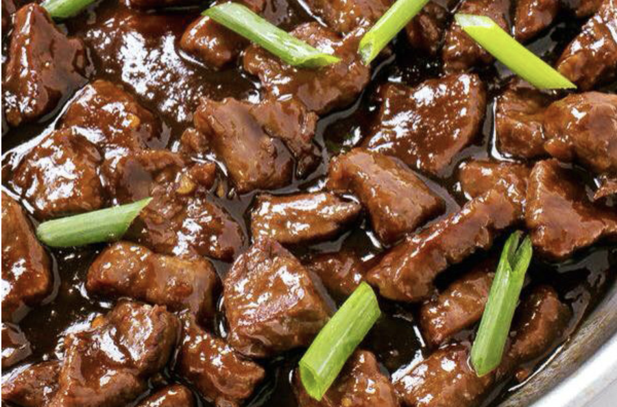
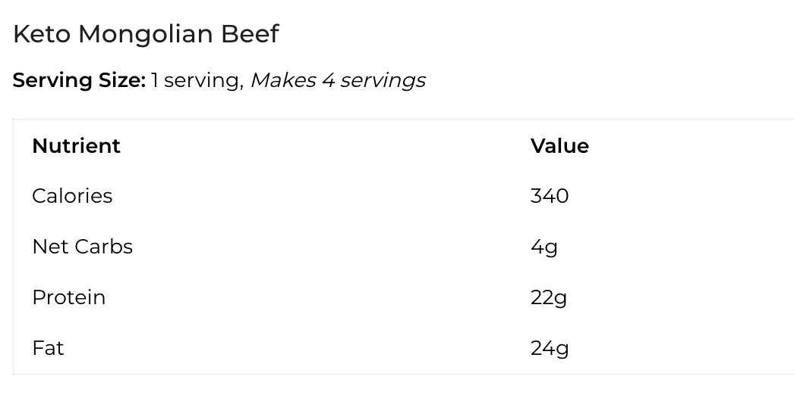

## PREP

# INGREDIENTS

#### Keto Mongolian Sauce

- ½ cup coconut aminos
- 2 tablespoons unrefined sesame oil
- 1 tablespoon granulated sweetener We love golden monk fruit
- 3-5 minced garlic cloves
- 1 tablespoon rice wine vinegar
- 2 tablespoons of almond butter
- 1-2 tsp of hot sauce
- 1 tsp ginger
- ½ tablespoon red pepper flakes optional
- ¼ teaspoon xanthan gum

#### Mongolian Beef

- 1 lb flank steak sliced into thin strips (can also use ground hamburger or pork)
- 1 tablespoon olive oil or algae oil I prefer algae oil because of its high smoke point.
- 1 scallion

# INSTRUCTIONS

#### Keto Mongolian Sauce

- In a medium-size saucepan, bring all ingredients to a slow boil. Then turn down the heat and continue to simmer for about 5 min. Remove from heat, add xanthan gum, whisk well so xanthan gum does not clump.
    

#### Mongolian Beef

- In a skillet, heat oil until hot. Add beef strips and fry, stirring until it begins to brown.
    
- Add in half of the sauce (reserve some for dipping), and cook for another minute or two, stirring constantly.
    
- Divide between plates and garnish with some sliced scallions.
    
- It can be served over some broccoli florets or cauliflower rice.

## NUTRITIONS

## NOTES

## TIPS

### *EXTRA*

