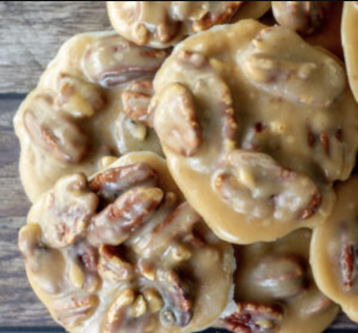

###### *RELATED* : 
---
Pecan Pralines are creamy and sweet with toasted pecans. My Keto Pecan Pralines Recipe cooks in about ten minutes and is ready to eat in under an hour!

---
## PREP

---
# INGREDIENTS

- [ ] 1 cup pecans toasted
- [ ] 5 tablespoon butter divided
- [ ] 6 tablespoon light cream (or heavy cream)
- [ ] ⅓ cup Joy Filled Eats Sweetener (or see alternatives in recipe notes)
- [ ] ¼ teaspoon vanilla
- [ ] pinch salt

---
# INSTRUCTIONS

1. Combine 4 tablespoon of the butter with the sweetener and cream over medium heat. Stir until sweetener is dissolved.
2. Cook until it is a deep golden brown. As soon as it reaches that deep color (right before burning) remove from the heat and immediately add the other 1 tablespoon butter and vanilla. Stir until smooth.
3. Add the salt and toasted pecans. Drop by spoonfuls onto on wax paper. Refrigerate just until firm.

---
## NOTES

**To toast nuts:** I toast nuts at 400 degrees until they are lightly browned and smell fragrant, about 5 minutes.

**How to store** **pralines:**

Store at room temperature for up to 2 days. For longer storage, you can refrigerate the pralines but they will firm up more and turn whitish from the sweetener crystallizing. They are still delicious!

**Notes on Sweeteners:** 

_**Substitutions may not work in candies.** This is one recipe I do not recommend trying other sweeteners. I have only tested it with my own sweetener blend. I'm not sure if other sweeteners work. If you try another sweetener and it does not work please do not leave me a negative review._

---
## TIPS

---
## NUTRITIONS

This recipe makes 10 pralines. There are 0.8 NET carbs per serving

Serving: 1piece | Calories: 145.2 | Carbohydrates: 1.7g | Protein: 1.2g | Fat: 15.6g | Saturated Fat: 5.9g | Polyunsaturated Fat: 2.4g | Monounsaturated Fat: 6.3g | Trans Fat: 0.2g | Cholesterol: 25mg | Sodium: 53mg | Potassium: 51.1mg | Fiber: 0.9g | Sugar: 0.4g | Vitamin A: 271.6IU | Vitamin C: 0.2mg | Calcium: 14.8mg | Iron: 0.3mg

---
### *EXTRA* :

