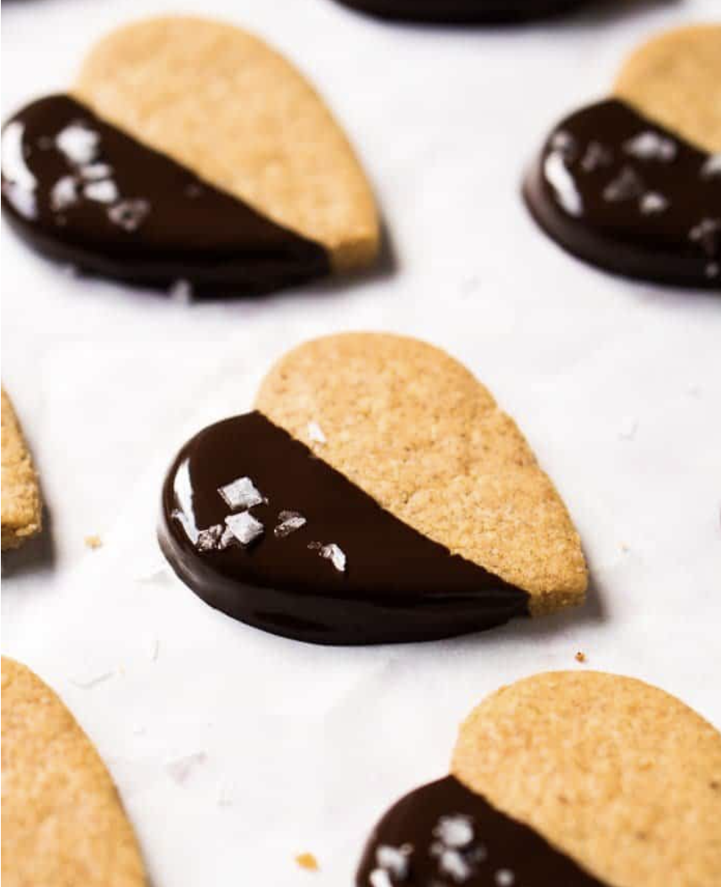

## NOTES

**(TOASTED ALMOND!)**
**(difficile à manipuler, sortir la pâte du frigo en portions) Bon mais pas plus**

## PREP

# INGREDIENTS

1 1/2 cups almond flour

1/2 teaspoon xanthan gum

1/4 teaspoon kosher salt

6 tablespoons grass-fed butter at room temperature

6 tablespoons erythritol powdered*

1/2 teaspoon vanilla extract

FOR THE CHOCOLATE COATING (OPTIONAL)

    •    
dark chocolate such as Lily's, melted

    •    
flakey sea salt

# INSTRUCTIONS

 1    Add almond flour to a dry skillet or pan, and toast over medium heat until golden and fragrant (3-6 minutes). Remove from pan, whisk in xanthan gum, salt and set aside to cool completely (very important!). 


    2    Cream butter in a large bowl with an electric mixer, 2-3 minutes. Add in sweetener and continue to beat until thoroughly mixed and much of the sweetener has dissolved. Add in vanilla extract and beat until just combined.


    3    With your mixer on low, add in half of your almond flour mixture- mixing until just incorporated. Mix in the rest.


    4    Wrap cookie dough with cling film (saran wrap) and refrigerate for at least an hour. 


    5    Preheat oven to 350°F/180°C and have a baking tray handy.


    6    Roll out dough between parchment paper and either simply slice with a knife or do cutouts. Place shaped cookies with parchment paper on the prepared baking tray and place in the freezer for 15 minutes prior to baking.


    7    Bake until just lightly golden. Baking times will vary widely depending on size of cookies and oven, but think 10-13 minutes for the small ones or 15-18 minutes for the larger ones.  

    8    


    9    Allow to cool on pan as they'll be very fragile when warm. Store in an airtight container for up to 1 week.

## NUTRITIONS

*I did find that powdering it prevents unpleasant minty crystals from forming post bake. But the great news is that I found the cooling effect to pretty much disappear overnight #magic.

  

The shaped dough can be frozen for up to 3 months, and they can be baked straight from the freezer (adding 2-3 minutes more to the baking time).

Please note that we calculated nutrition facts for two dozen cookies, but we actually got more like 35 out of the batch (with loads of munching on the actual cookie dough!).

## TIPS

*Please **see section on Sweeteners** for more deets on powdering and sweetening options. 

The shaped dough can be frozen for up to 3 months, and they can be baked straight from the freezer (adding 2-3 minutes more to the baking time).

Please note that we calculated nutrition facts for **two dozen cookies**, but we actually got more like 35 out of the batch (with loads of munching on the actual cookie dough!).

