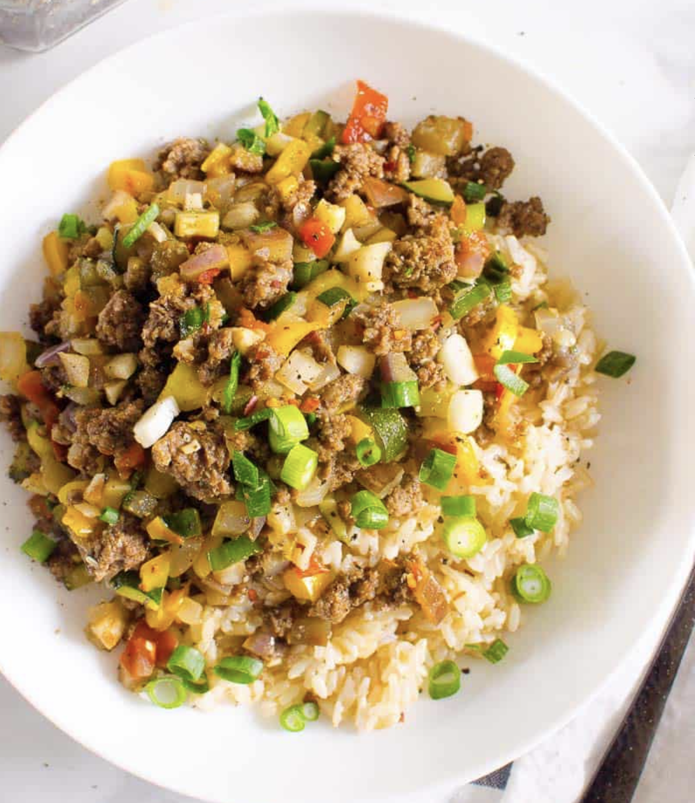

Korean Ground Beef and Rice Bowls is a 30 minute, healthy ground beef recipe full of vegetables, Asian flavored sauce, then served over hearty brown rice or go low carb with cauliflower rice. This weeknight dinner is easily customizable and will have your family going for seconds!

## PREP

# INGREDIENTS

- ▢1 lb [ground beef](https://www.target.com/p/all-natural-85-15-ground-beef-1lb-good-38-gather-8482/-/A-13288295&aflt=plt?aflt=plt) [Je l'ai fait mariner dans 2 c. thé de chacun: sauce soya, fécule de maïs, vin rouge]
- ▢1 [large onion](https://www.target.com/p/red-onion-each/-/A-14917313?aflt=plt) diced
- ▢1-2 inch [fresh ginger](https://www.target.com/p/ginger-root-6oz/-/A-23974827?aflt=plt#lnk=sametab) minced
- ▢2 [large garlic cloves](https://www.target.com/p/spice-world-fresh-whole-garlic-3ct-bag/-/A-14917318?aflt=plt#lnk=sametab) minced
- ▢1 tbsp [oil](https://amzn.to/3H4ef0z)
- ▢1 [bell pepper](https://www.target.com/p/tri-colored-bell-peppers-16oz-3ct-good-38-gather-8482-packaging-may-vary/-/A-78832378?aflt=plt) diced
- ▢2 [medium zucchini](https://www.target.com/p/organic-zucchini-2ct/-/A-85825253?aflt=plt#lnk=sametab) diced
- ▢1 small eggplant diced
- ▢1 [tomato](https://www.target.com/p/beefsteak-tomatoes-13oz-2ct-good-38-gather-8482-packaging-may-vary/-/A-82628083?aflt=plt#lnk=sametab) diced (optional)
- ▢4-5 tbsp [soy sauce](https://amzn.to/3bYdOX6) I used Bragg’s liquid aminos
- ▢1 tbsp [rice vinegar](https://amzn.to/3bZoxRj)
- ▢3 tbsp [maple syrup or honey](https://amzn.to/3037uLo) [coconut sugar]
- ▢[Ground black pepper](https://amzn.to/3kH0r2D) to taste
- ▢Pinch [red pepper flakes](https://amzn.to/3qnZXSC)
- ▢4 green onion sprigs finely chopped

# INSTRUCTIONS

- Cook rice as per package instructions. I usually make [Instant Pot brown rice](https://ifoodreal.com/instant-pot-brown-rice/).
    
- While rice is cooking, preheat wok or large deep non-stick skillet on medium heat. Add ground beef and cook breaking into pieces and stirring constantly, for about 5-7 minutes. Drain fat if desired. I have to say I used [Instant Pot frozen ground beef](https://ifoodreal.com/instant-pot-frozen-ground-beef-turkey/), so I cooked it less time. It is a miracle recipe!
    
- Towards the end of browning ground beef, add onion, ginger and garlic. Cook for 2-3 minutes, stirring occasionally. Remove beef onto plate and return skillet to the stove.
    
- Swirl oil to coat, add bell pepper and saute for 3 minutes, stirring occasionally. Add zucchini, eggplant and tomato; saute for another 5 minutes, stirring occasionally.
    
- Add soy sauce, rice vinegar,  maple syrup, pepper and red pepper flakes. Stir and cook for 1 minute. Add cooked beef and stir. Turn off the heat and sprinkle with green onion; stir again.
    
- Fluff rice with a fork and serve Korean ground beef over it.

## NUTRITIONS

Calories: 211kcal | Carbohydrates: 20g | Protein: 19g | Fat: 7g | Saturated Fat: 2g | Cholesterol: 47mg | Sodium: 416mg | Fiber: 4g | Sugar: 15g

## NOTES

Truth is you can use any ground meat, like ground turkey or chicken.

Other firm veggies: Like cabbage, broccoli or even cauliflower. Whatever you have on hand.

Tomato: It is optional, so if you have one on hand. I like how it holds its juiciness, soft texture and freshness while other veggies become more cooked.

Optional additions: You can also add cashews, water chestnuts, shredded carrots. Possibilities are endless!

Fresh garlic or ginger substitutes: If missing fresh, use 1 tsp of garlic powder and 1/2 tsp ground ginger respectively.

Serving Ideas

With whole grain side: The first time I made it, I served it over brown rice. Second time with quinoa. Third time with brown rice noodles.

Lettuce wraps: Make it as an appetizer and serve on lettuce leaves as a wrap.

Korean "tacos": Wrap Korean style ground beef in flour tortillas and add shredded cabbage and make “tacos”. Then garnish with red garlic chili sauce.

Low carb meal: For low carb dinner serve over cauliflower rice.

- **Store:** Refrigerate leftovers in an airtight container for up to 5 days. Store beef and veggies mix separately from rice, so the grain doesn’t soak up all delicious juices. Reheat in a skillet with a splash of water or broth, simmering on low while covered, stir occasionally. 
- **Freeze**: If it contains zucchini. do not freeze. If you used more sturdy veggies like broccoli, cauliflower and eggplant, then it’s fine. Freeze in an airtight container for up to 3 months. Thaw in the fridge overnight.
- **Ground beef:** I used organic hamburger with 85% fat. Truth is you can use any ground meat, like ground turkey or chicken.
- **Other firm veggies:** Like cabbage, broccoli or even cauliflower. Whatever you have on hand.
- **Tomato:** It is optional, so if you have one on hand. I like how it holds its juiciness, soft texture and freshness while other veggies become more cooked.
- **Optional additions:** You can also add cashews, water chestnuts, shredded carrots. Possibilities are endless!
- **Fresh garlic or ginger substitutes:** If missing fresh, use 1 tsp of garlic powder and 1/2 tsp ground ginger respectively.

## TIPS

### *EXTRA*

