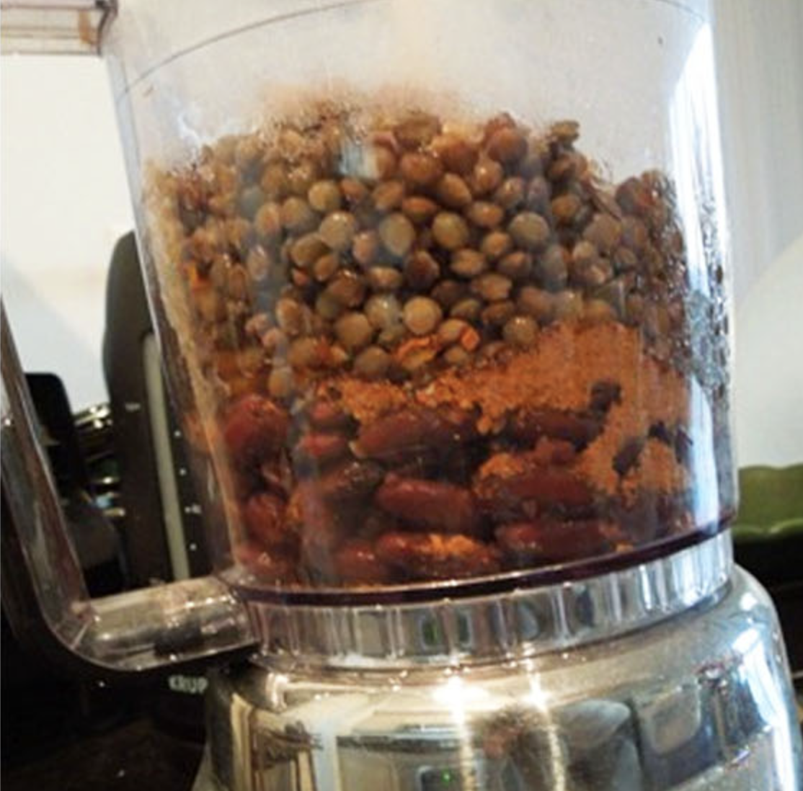

###### *RELATED* : 
---
A hearty recipe that is easy to make, and super healthy.

---
## PREP | COMMENTS

---
# INGREDIENTS

- [ ] 1 cup soaked and cooked lentils
- [ ] 1 cup red beans
- [ ] 1/2 cup pureed carrots a la sneaky chef
- [ ] oregano
- [ ] chili pepper
- [ ] paprika
- [ ] cumin
- [ ] garlic salt
- [ ] black pepper

---
# INSTRUCTIONS

1. Adjust total qty of beans for how large you want the batch to be
2. Put all ingredients in food processor and pulse
3. I like it really spicy, so start with 1/2 tsp each and adjust…I used a lot more ?
4. Serve it up with a bed of greens, sliced peppers, salsa and avocado

---
## NOTES

**_Soak your lentils before cooking. TIP: Just dump them in a bowl with water before heading to work or bed._**

---
## TIPS

---
## NUTRITIONS

---
### *EXTRA* :

