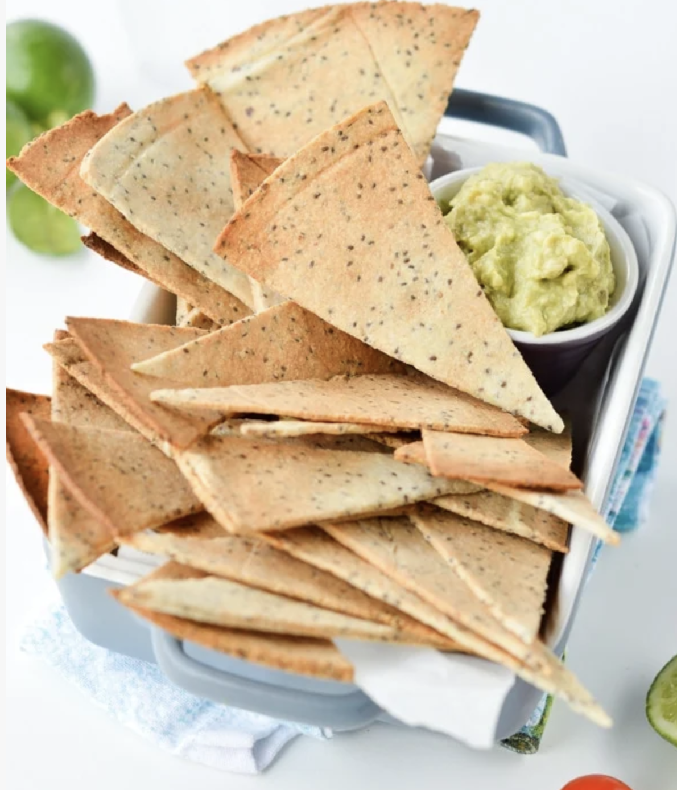

###### *RELATED* : 
---
Low Carb Tortillas Chips, quick and easy baked keto chips with only 5 ingredients. 100 % grain-free, Paleo + Vegan. Those are life changing chips made of almond meal and chia seeds and only 0.4 net carb per chips.

---
## PREP | COMMENTS

Prep Time10 mins
Cook Time8 mins
Total Time18 mins

---
# INGREDIENTS

- [ ] 1 tablespoon [black chia seeds](https://www.amazon.com/gp/product/B009AH7OU8/ref=as_li_qf_asin_il_tl?ie=UTF8&tag=sweetashoney-20&creative=9325&linkCode=as2&creativeASIN=B009AH7OU8&linkId=a1a8bc0bc6dde9264c10c52da284391b)
- [ ] 1/4 cup water
- [ ] 1 cup [almond meal](https://www.amazon.com/gp/product/B0082GV1Z2/ref=as_li_tl?ie=UTF8&camp=1789&creative=9325&creativeASIN=B0082GV1Z2&linkCode=as2&tag=sweetashoney-20&linkId=2cb569127020fcfe0bc54b7a7980aeee) - I used blanched almond meal/ground
- [ ] 1 tablespoon [olive oil](https://www.amazon.com/gp/product/B00GGBLPVU/ref=as_li_qf_sp_asin_il_tl?ie=UTF8&tag=sweetashoney-20&camp=1789&creative=9325&linkCode=as2&creativeASIN=B00GGBLPVU&linkId=5eca04e09e1c3f081c1e6b27d931aa62)
    
#### **Spices recommended**

- [ ] 1/4 teaspoon [ground cumin](https://www.amazon.com/gp/product/B001PQOAOA/ref=as_li_qf_sp_asin_il_tl?ie=UTF8&tag=sweetashoney-20&camp=1789&creative=9325&linkCode=as2&creativeASIN=B001PQOAOA&linkId=1d080a44d0229969b1debe7c33616a21)
- [ ] 1/4 teaspoon [salt](https://www.amazon.com/gp/product/B000EITYUU/ref=as_li_qf_asin_il_tl?ie=UTF8&tag=sweetashoney-20&creative=9325&linkCode=as2&creativeASIN=B000EITYUU&linkId=c8924952c19d12e5ac5280f60674aa05)
- [ ] 1/4 teaspoon [garlic powder](https://www.amazon.com/gp/product/B074ZK8MQS/ref=as_li_qf_asin_il_tl?ie=UTF8&tag=sweetashoney-20&creative=9325&linkCode=as2&creativeASIN=B074ZK8MQS&linkId=eaf15c42fa600475fe7fc529de4b5b9d)
- [ ] 1 teaspoon [nutritional yeast](https://www.amazon.com/gp/product/B00J9PYT9U/ref=as_li_qf_asin_il_tl?ie=UTF8&tag=sweetashoney-20&creative=9325&linkCode=as2&creativeASIN=B00J9PYT9U&linkId=8456603ac8ae8be9e24d7553838b550b) - optional great for a natural cheese flavor

---
# INSTRUCTIONS

1. Preheat oven to 200 C (390F)
2. In a small bowl add the chia seeds and water. Stir with a spoon to combine. Set aside for 10 minutes or until a gel-like texture form. 
3. In another large mixing bowl, add almond meal, olive oil, spices and the chia seed gel created before.
4. Knead dough by hands, squeezing the mixing between your finger to incorporate the chia gel into the almond meal, until it forms a dough. It shouldn't take more than 1 minute to form a dough ball. 
5. Place the dough ball between two pieces of parchment paper, and rool out with a rolling pin as thinly as possible. 
6. Remove the top layer of parchment paper, cut out tortillas chips using a pizza cutter or sharp knife. To make triangle chips (tortillas shapes), simply place a round shape on top of the rolled dough. Cut around the lid, remove the dough outside of the lid - keep it for later to roll again and make more chips! You should end up with a circle of rolled dough. Then, using the pizza cutter cut triangle as you will cut a round cake.
7. Move the dough with parchment paper  onto a baking sheet.
8. Bake for 6 minutes, check the color and stop baking as soon as you reach a golden brown color. For very thin chips it took 6-7 minutes. For thicker chips it could take up to 8-9 minutes. I recommend you to bake for 6 minutes then check every 1 minute to avoid the chips to burn. 
9. Remove from the oven when golden brown and let cool for 5 minutes on the baking sheet
10. Use a flat tool like a knife or small spatula to remove/lift the tortillas chips from the parchment paper. 
11. Serve with my [simple avocado dip recipe](https://www.sweetashoney.co/simple-avocado-dip/) or dip of your choice.

---
## NOTES

**Storage:** Store up to 5 days in a airtight container -they will slightly soften after 3 days but you can rewarm them 1 minute at 75C (160F) for 1 minute just before serving to give them some crisp again. I recommend a metallic box or glass jar to keep the tortillas very crispy. **Freezing:** I don't recommend to freeze those chips. They will lose their crisp.**Spices ideas:** feel free to experiment with dried herbs like rosemary, oregano or onion flakes, smoked paprika, turmeric powder, curry powder or even matcha powder!**Salt:** the recipe is using only 1/4 teaspoon salt which keep the chips low in sodium and healthy. If you love salty chips feel free to add more salt but don't exceed 1/2 teaspoon salt.**Net carbs per chips (carbs take away fibre)** : 0.4 g

---
## TIPS

---
## NUTRITIONS

---
### *EXTRA* :

