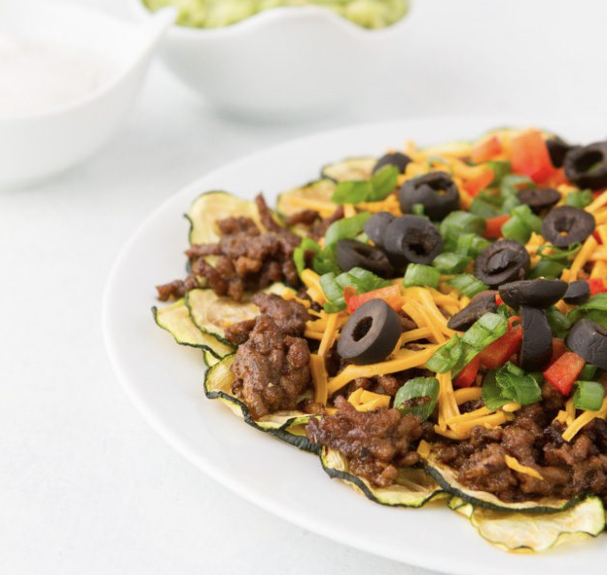
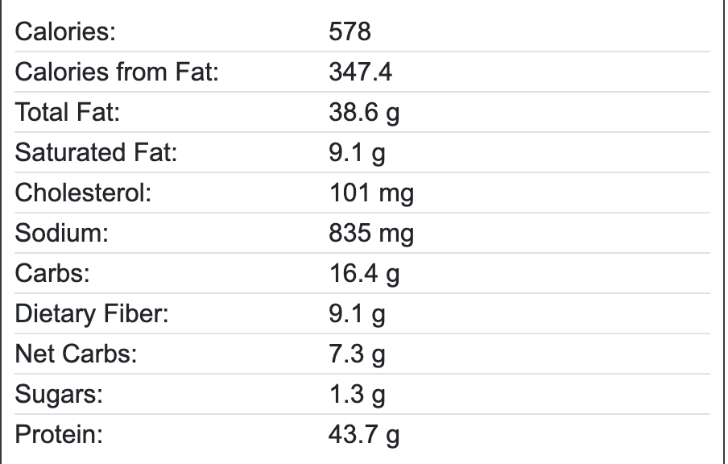

Disks of crisp zucchini slices topped with spicy beef, olives, green onions and dairy-free cheese. Made paleo-friendly without the cheese. Served alongside MCT guacamole enriched with Equip Collagen Peptides. MACROS Fat 60% Carbs 10% Protein 30%.

## PREP

# INGREDIENTS

### **Low-Carb Nacho Chips**

- 2 medium zucchini, sliced into thin rounds
    

### **Meat**

- 1/2 pound (225 g) regular ground beef
    
- 1/2 tablespoon [chili powder](http://amzn.to/2mVUP3x)
    
- 1/2 teaspoon [finely ground gray sea salt](http://amzn.to/2nNv7TP)
    
- 1/2 teaspoon [paprika](http://amzn.to/2nNDSxj)
    
- 1/2 teaspoon [ground cumin](http://amzn.to/2nNNSXt)
    
- 1/4 teaspoon [garlic powder](http://amzn.to/2ni2i0j)
    
- 1/4 teaspoon [onion powder](http://amzn.to/2mZvxm1)
    
- 1/4 teaspoon [crushed red pepper flakes](http://amzn.to/2ncoh7a)
    
- 1/4 teaspoon [dried oregano leaves](http://amzn.to/2nNMUug)
    

### **MCT Guacamole  (origan fait très bon, ajout de jus de citron)**

- 1 avocado
    
- 2 tablespoons [Vital Proteins Collagen Peptides](http://amzn.to/2roontG)
    
- 1 tablespoon [MCT oil](http://amzn.to/2ntdo2X)
    
- 1 tablespoon [apple cider vinegar](http://amzn.to/2mW1omG)
    
- 1/2 teaspoon [dried oregano](http://amzn.to/2nNMUug)
    
- 1/4 teaspoon [finely ground gray sea salt](http://amzn.to/2nNv7TP)
    
- pinch [vitamin C crystals](http://amzn.to/2nIGax6), optional
    

### **Toppings**

- 1/3 cup (38 g) shredded dairy-free cheese, optional
    
- 3 tablespoons sliced black olives
    
- 2 green onions, sliced

# INSTRUCTIONS

1. Line a large plate with parchment paper, placing each of the zucchini disks onto the paper being sure to not overlap. You will have to cook the zucchini in batches.
    
2. Transfer the plate to the microwave and cook for 8 to 10 minutes on 50% power setting. You know the chips will be done with the edges curl and the middles get slightly golden. Once complete, remove the parchment paper from the microwave, flip over, and drop the chips onto a cooling rack. Repeat with remaining zucchini rounds.
    
3. Meanwhile, place all the meat ingredients into a large frying pan. Heat on medium, rotating frequently, until the meat is no longer pink.
    
4. Combine all of the MCT Guacamole ingredients together in a medium-sized bowl. Mash until combined.
    
5. Transfer chips to a clean plate. Top with cooked meat, cheese, olives, and sliced green onions. Serve alongside MCT guacamole.

## NUTRITIONS

## NOTES

Paleo: to keep the recipe paleo, remove the dairy-free cheese

## TIPS

### *EXTRA*

