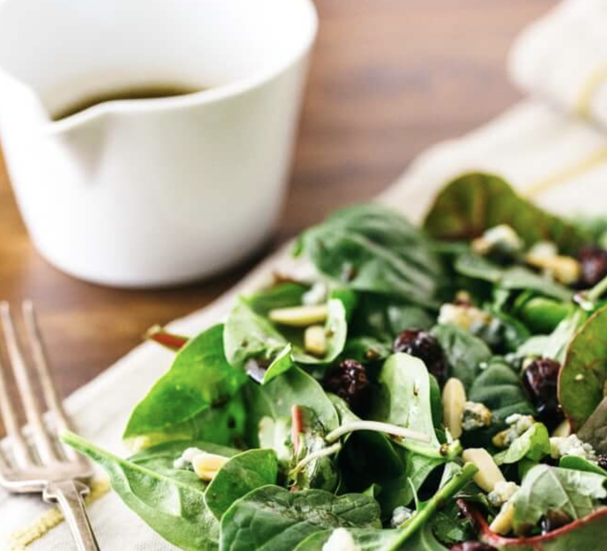
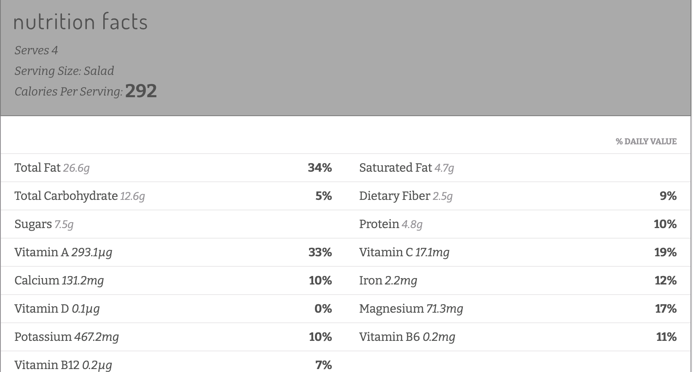

###### *RELATED* : 
---
_**This mixed green salad with balsamic vinaigrette is a quick and easy side dish! In just 10 minutes you have a healthy accompaniment to any meal.**_

---
## PREP | COMMENTS

Pour 8 t. de laitues

---
# INGREDIENTS

- [ ] 2 tablespoons aged balsamic vinegar
- [ ] 2 tablespoons Dijon mustard
- [ ] 1 tablespoon maple syrup (or honey) miel utilisé
- [ ] ¼ teaspoon [kosher salt](https://www.acouplecooks.com/what-is-kosher-salt/)
- [ ] 6 tablespoons olive oil
    
#### **For the salad**
    
- [ ] 8 cups salad greens
- [ ] ¼ cup dried cherries (or cranberries)
- [ ] ¼ cup cheese crumbles (feta, goat, or gorgonzola)
- [ ] ¼ cup slivered almonds (or walnuts, pecans, or pistachios)

---
# INSTRUCTIONS

1. In a medium bowl, whisk together the balsamic vinegar, Dijon mustard, maple syrup, and salt until fully combined. Gradually whisk in the olive oil, adding 1 tablespoon at a time and whisking until it incorporates, until an emulsion forms. Serve immediately. Store refrigerated and bring to room temperature before serving (keeps at least 2 weeks).
    
2. Dress 8 cups salad greens with the desired amount of dressing; reserve the rest for future use.
    
3. On each plate, place 2 cups salad greens and sprinkle with dried fruit, cheese crumbles, and nuts.

---
## NOTES

---
## TIPS

---
## NUTRITIONS

---
### *EXTRA* :

