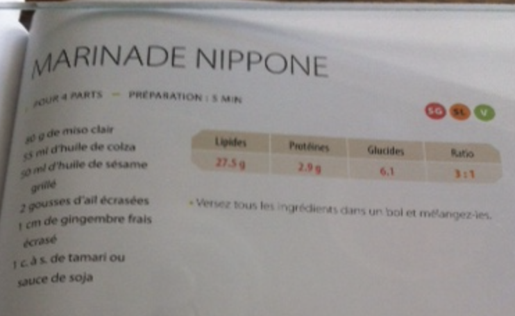

###### *RELATED* : 
---

---
## PREP | COMMENTS

_Provient du livre de la céto-cuisine de Louise_

---
# INGREDIENTS

- [ ] 80 g de miso clair
- [ ] 55 mL d'huile de colza
- [ ] 50 mL d'huile de sesame
- [ ] 2 gousses d'ail ecrasees
- [ ] 1 c. a s. de tamari ou sauce de soja

---
# INSTRUCTIONS

1. Versez tous les ingredients dans un bol et melangez-les

---
## NOTES

---
## TIPS

---
## NUTRITIONS

---
### *EXTRA* :

