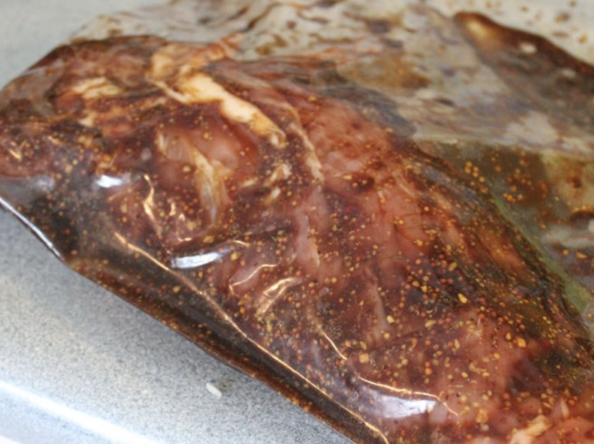

###### *RELATED* : 
---

---
## PREP | COMMENTS

---
# INGREDIENTS

- [ ] 2 cuillères à soupe de miel
- [ ] 2 cuillères à soupe de moutarde de Dijon
- [ ] 2 cuillères à soupe de vinaigre balsamique
- [ ] 1 cuillère à soupe d’huile d’olive
- [ ] 1 cuillère à thé d’ail émincée
- [ ] 1 cuillère à thé de sel
- [ ] 1/2 cuillère à thé de poivre
- [ ] Des filets de porc
- [ ] Un gros sac ziplock

---
# INSTRUCTIONS

1. Bien mélanger tous les ingrédients dans un bol.
    
2. Mettre le porc dans un grand sac ziplock.
    
3. Verser la marinade par dessus.
    
4. Réfrigérer pendant au moins 2 heures, ou encore mieux pour 24 heures.
    
5. Si vous voulez utiliser la marinade comme sauce, assurez-vous de bien la faire bouillir afin de tuer toutes les bactéries.

---
## NOTES

---
## TIPS

---
## NUTRITIONS

---
### *EXTRA* :

