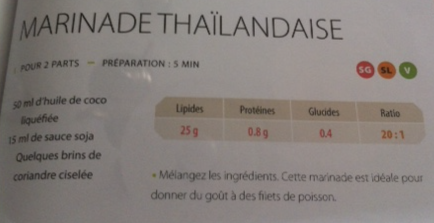

###### *RELATED* : 
---

---
## PREP | COMMENTS

_Provient du livre de la céto-cuisine de Louise_

---
# INGREDIENTS

- [ ] 50 mL d'huile de coco liquefiee
- [ ] 15 mL de sauce soja
- [ ] Quelques brins de coriandre ciselee

---
# INSTRUCTIONS

1. Versez tous les ingredients dans un bol et melangez-les
2. Parfait pour donner du gout a des filets de poisson

---
## NOTES

---
## TIPS

---
## NUTRITIONS

---
### *EXTRA* :

