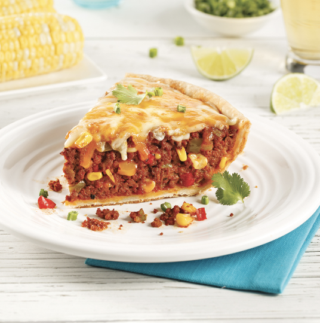

Voici le MEILLEUR pâté mexicain, rien de moins! Intégrez cette recette incontournable à base de boeuf haché au menu pour régaler toute la famille!

## PREP

TEMPS DE PRÉPARATION 
25 minutes

TEMPS DE CUISSON 
46 minutes

# INGREDIENTS

15 ml (1 c. à soupe) d’ huile d’olive

625 g (environ 1 1/3 lb) de boeuf haché mi-maigre

1 oignon haché

1 branche de céleri coupée en dés

15 ml (1 c. à soupe) d’ ail haché

15 ml (1 c. à soupe) d’ assaisonnements à chili

180 ml (3/4 de tasse) de ketchup

180 ml (3/4 de tasse) de sauce chili

3 demi-poivrons de couleurs variées coupés en dés

250 ml (1 tasse) de maïs en grains

15 ml (1 c. à soupe) de paprika fumé

sel et poivre au goût

300 g (2/3 de lb) de pâte à tarte

375 ml (1 1/2 tasse) de mélange de fromages râpés de type tex-mex

125 ml (1/2 tasse) de crème sure 14%

# INSTRUCTIONS

## NUTRITIONS

Par portion: calories 550; protéines 25 g; matières grasses 32 g; glucides 40 g; fibres 4 g; fer 3 mg; calcium 208 mg; sodium 1 050 mg

## NOTES

## TIPS

### *EXTRA*

