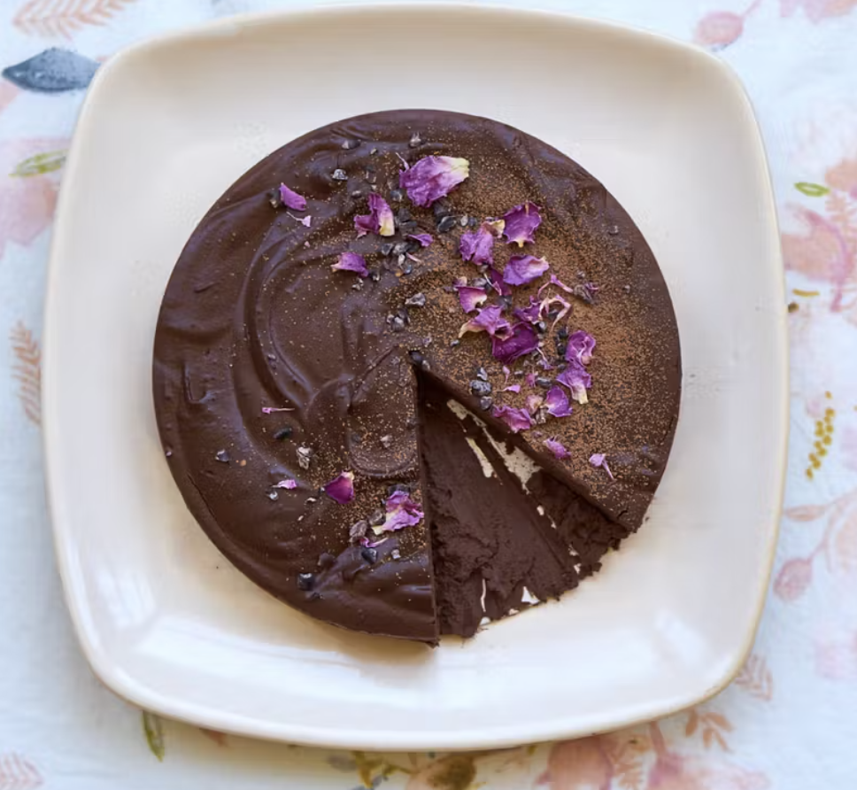

###### *RELATED* : 
---
The easiest chocolate cake you'll ever make. And it's always a huge hit. It's the sort of easy dessert perfect for summer, and entertaining, because you don't need to heat your oven.

---
## PREP | COMMENTS

Prep Time

5 mins

Cook Time

5 mins

Total Time

10 mins

---
# INGREDIENTS

- [ ] butter, to grease pan
- [ ] 8 ounces / 225 g 70% chocolate, well chopped
- [ ] 8 ounces / 225 g heavy cream
- [ ] 1/2 teaspoon allspice (optional)
- [ ] 2 teaspoons finely ground espresso (optional)
- [ ] 1/4 teaspoon fine grain salt
- [ ] cocoa powder, to serve
- [ ] optional other toppings: rose petals, cacao nibs

---
# INSTRUCTIONS

1. Lightly butter a 6-inch / 15cm springform pan or equivalent - I typically use little loaf pans which are less common, but many small pans will work here (see main entry). Line with parchment paper and set aside.
2. Barely melt the chocolate in a double boiler over gentle heat.
3. In a separate medium pan heat the cream over gentle heat. Stir in the allspice and the espresso, if using. When the cream is very warm / hot to the touch, remove from heat and stir in the salt.
4. Pour the chocolate into the cream, and very slowly and steadily stir until everything comes together smoothly. Make sure the components aren't at all separate. Pour into the prepared pan, cover with plastic wrap and refrigerate until chilled throughout, a few hours, or overnight.
5. When ready to serve, remove from the pan, let set at room temperature for ten minutes or so, dust with a bit of cocoa powder, and slice. Alternately, you can slice and serve from the pan.

---
## NOTES

---
## TIPS

---
## NUTRITIONS

Calories 160

Fat 11g

Saturated Fat 7g

Cholesterol 28mg

Sodium 68mg

Potassium 14mg

Carbohydrates 13g

Fiber 0g

Sugar 11g

Protein 1g

Vitamin A 320IU

Vitamin C 0.2mg

Calcium 34mg

Iron 0.2mg

---
### *EXTRA* :

