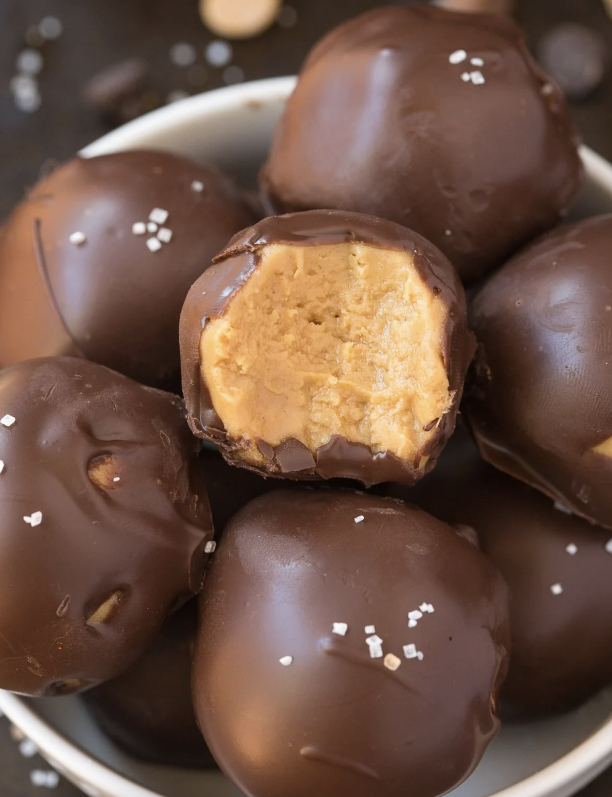

###### *RELATED* : 
---
An easy 4-ingredient recipe for no bake low carb keto chocolate peanut butter protein balls! A thick and fudgy peanut butter center, covered in a sugar-free chocolate. These 5-minute keto chocolate peanut butter fat bombs are a quick healthy dessert or protein-packed snack with a peanut-free option! Paleo, Vegan, Gluten Free.

---
## PREP | COMMENTS

PREP:5minutes mins
COOK:5minutes mins
TOTAL:10minutes mins

---
# INGREDIENTS

- [ ] 2 cups smooth peanut butter 
- [ ] 3/4 cup coconut flour
- [ ] 1/2 cup sticky sweetener of choice
- [ ] 2 cups sugar-free chocolate chips

---
# INSTRUCTIONS

1. Line a large plate or tray with parchment paper and set aside.
2. In a mixing bowl, combine all your ingredients, except for chocolate chips, and mix until fully combined. If the batter is too thick and crumbly, add some liquid (water or milk) slowly until a thick, formable batter remains. 
3. Using your hands, form small balls and place on the lined plate or tray. Freeze for 10 minutes.
4. While the peanut butter balls are firming up, melt your sugar-free chocolate chips. Remove the peanut butter protein balls from the freezer and using two forks, dip each ball in the melted chocolate until completely covered. Repeat until all the balls are covered in chocolate.
5. Refrigerate for 20 minutes, or until the chocolate coating has firmed up.

---
## NOTES

* You can sub the peanut butter for any smooth nut or seed butter of choice

** I used a monk fruit sweetened maple syrup. For a paleo/vegan sweetener, you can use maple syrup, agave nectar or honey (not strictly vegan)

***For a non-keto option, any chocolate chips of choice work. 

No Bake Keto Chocolate Peanut Butter Balls (Paleo, Vegan, Low Carb) can keep at room temperature, for up to 5 days. They are best refrigerated, and are freezer friendly.

---
## TIPS

---
## NUTRITIONS

Serving: 1BallCalories: 54kcalCarbohydrates: 3gProtein: 2gFat: 4gPotassium: 3mgFiber: 1.5gVitamin A: 50IUVitamin C: 0.8mgCalcium: 10mgIron: 0.5mgNET CARBS: 2g

---
### *EXTRA* :

