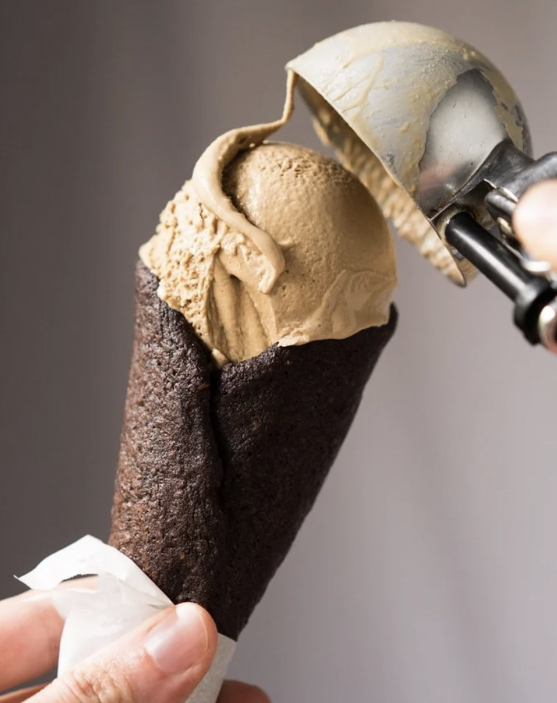

###### *RELATED* : 

Expect this (no-churn!) keto ice cream recipe to be ridiculously creamy and absolutely tasty! And whichever flavor you go for, it won't freeze rock solid like your usual homemade ice cream. 

Oh, and if baking with cups rather than grams is your thing, just click on US Cups for an instant conversion.

## PREP

# INGREDIENTS

#### For the paleo & keto vanilla ice cream

- 1 [vanilla bean (i.e. pod)](https://amzn.to/2Hlbc8M) or more vanilla extract
- 1 13.5-ounce can [full fat coconut milk](https://amzn.to/2IG1URJ) *
- 135-150 g [xylitol](https://amzn.to/2OvrMTy) erythritol, to taste*
- 1/4 teaspoon [kosher salt](https://amzn.to/2uM2LxM)
- 1/4 teaspoon [xanthan gum](https://amzn.to/2uKe4GF) or 3/4 teaspoon arrowroot flour if paleo&**
- 480 g heavy whipping cream or chilled coconut cream (see notes)*
- 2 teaspoons [vanilla extract](http://amzn.to/2gVTsV4) up to 4 or 6 teaspoons if not using a vanilla pod
- 1 tablespoon vodka, brandy or booze of choice omit if using the larger quantity of vanilla extract****

#### Flavor variants

- 50 g [cocoa powder](http://amzn.to/2xydo3V) for chocolate ice cream
- 3 tablespoons [espresso powder](http://amzn.to/2EOzc2k) for coffee ice cream
- 225 g fresh berries for fruity ice cream
- ['oreo' cookie crumbs](https://www.gnom-gnom.com/keto-cookies-cream-fat-bombs/) for cookies and cream
- [keto marshmallows](https://www.gnom-gnom.com/paleo-keto-marshmallows/) for rocky road ice cream

# INSTRUCTIONS

- See recipe video for guidance!
    
- Slice open the vanilla bean and scrape the seeds with a sharp knife. 
    
- Add coconut milk, sweetener, vanilla bean with scraped seeds (if using), and salt to a saucepan over medium heat. Whisk until all the solids from the coconut milk have the dissolved and the mixture is smooth. If using a vanilla bean, simmer for 15 minutes to infuse the milk.  
    
- Remove the vanilla bean and sprinkle xanthan gum little by little and blend until fully combined. If paleo and using arrowroot, dissolve it first in a tablespoon of cold water (i.e. make a slurry). You will likely have some air bubbles, but be sure to check there are no lumps. Any lumps will be resolved by mixing with an immersion blender (or in an actual blender). Sieve the mixture to a bowl, cover with a layer of cling film (saran wrap) laid directly over the vanilla mixture, and allow the mixture to cool completely. The texture will be thick and jelly-like (don't worry, your ice cream won't have this texture!). 
    
- Add heavy whipping cream or cold coconut cream to a large chilled bowl and whip until soft peaks form. Mix in vanilla extract and the cooled vanilla mixture. 
    
- (Optional): add in your booze of choice (omit if using the larger quantity of vanilla extract). The mixture should be thick but still slightly pourable. And, if for any reason your mixture is too thick, thin it out little by little with more coconut milk. See recipe video for texture reference.  
    
- Transfer ice cream to a sealable container and place in the freezer until frozen (4-6 hours to overnight).  And note that you can still use your ice cream machine if you wish (roughly 15 minutes to churn). 
    
- If freezing overnight: take out your ice cream 10-20 minutes prior to serving (depending on your room temp!) and scoop away.
    

#### For flavor variants

- If making chocolate (coffee, matcha or using any dried fruit powder), simply add it to the coconut milk while cooking. 
    
- If making ice cream with fresh fruit, puree it and fold it in at the very end.

## NUTRITIONS

Calories: 235kcal | Carbohydrates: 2g | Protein: 1g | Fat: 25g | Saturated Fat: 17g | Cholesterol: 65mg | Sodium: 76mg | Potassium: 36mg | Vitamin A: 705IU | Vitamin C: 0.2mg | Calcium: 31mg

## NOTES

*You absolutely NEED to use [full fat coconut milk](http://amzn.to/2x9N7Lq) here! As lighter versions are simply diluted in water, and they'll make your ice cream more icy.

Whipping up [a cheesecake ice cream](https://www.gnom-gnom.com/keto-strawberry-cheesecake-ice-cream) or [frozen yogurt](https://www.gnom-gnom.com/paleo-keto-frozen-yogurt/) from our master base is super easy! For cheesecake you'll simply be swapping half of the heavy cream for cream cheese, and for froyo all of it for full fat (Greek style!) yogurt.

**Please see section on sweeteners for deets and possible subs. And if using xylitol, make sure to **be careful if you have a pup** around the house, as it’s highly toxic to the little guys! 🐕

***Be sure to measure a **_very_ lightly packed** 1/4 teaspoon of xanthan gum, as it's an ingredient that's easy to overpack. And if you overdo it, you'll get gummy ice cream. And if paleo, simply substitute it with 3/4 teaspoon [arrowroot flour](https://amzn.to/2F6LmzA). 

******Booze is totally optional**, it just keeps your ice cream from freezing rock solid. This ice cream is super creamy though, so 10-15 minutes at room temp make it ultra scoopable once again. 

Please note that nutrition facts were estimated per 1/2 cup serving. This recipe yields approximately 5 cups.

## TIPS

### *EXTRA*

