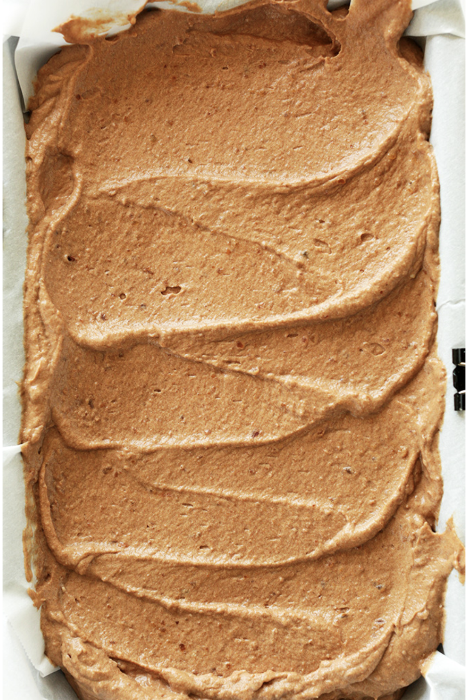

###### *RELATED* : 

5-ingredient no-churn vegan chocolate ice cream that has all the creaminess, flavor, and richness of the real thing! Naturally sweetened, vegan, and gluten-free.

## PREP

# INGREDIENTS

- 2 14-ounce cans coconut cream _OR_ full- fat coconut milk (chilled overnight in the fridge // I like Trader Joe’s coconut cream or Thai Kitchen coconut milk)
- 2/3 cup unsweetened cocoa or cacao powder powder
- 14-16 ounces pitted dates (if not sticky and moist, soak in warm water for 10 minutes then drain)
- 1 tsp pure vanilla extract
- 1/2 cup [unsweetened almond milk](https://minimalistbaker.com/how-to-make-almond-milk/)

#### OPTIONAL ADD-INs

- 1 ounce espresso (cooled)
- 1/2 tsp cinnamon
- [Cacao nibs](https://www.amazon.com/dp/B00DLMVHQ0/ref=as_at?creativeASIN=B00DLMVHQ0&linkCode=w61&imprToken=gNk4SF0uZOEX-8VkmsatRg&slotNum=1&tag=minimalistbaker-20)

# INSTRUCTIONS

- Place a large mixing bowl in the freezer to chill for 10 minutes.
    
- In the meantime, add moist, pitted dates to a [food processor](https://aax-us-east.amazon-adsystem.com/x/c/QqQvyuFwM5wAKbBWSUsxs8MAAAFlaHzhUQEAAAFKAbRsznI/https://www.amazon.com/dp/B00LBZOYAK/ref=as_at?creativeASIN=B00LBZOYAK&linkCode=w61&imprToken=1ANN27qilkGCO-p2pv-THQ&slotNum=39&tag=minimalistbaker-20) and process until small bits remain. Then add hot water a little at a time until it forms a thick paste. Set aside.
    
- Without tipping the cans, scoop out the coconut cream from the cans of coconut cream OR coconut milk, reserving the clear liquid for other uses. Place in chilled mixing bowl.
    
- **NOTE**: If you’re using coconut milk, you’ll likely use less sweetener because there’s less volume.
    
- Using a mixer, whip until creamy and smooth. Then add cocoa powder, vanilla, almond milk, and half of the date paste. Whip until fully incorporated.
    
- Taste and adjust flavors as needed. I ended up adding most of the date paste and a little more cocoa powder.
    
- Transfer to a parchment-lined freezer-safe container and cover loosely with plastic wrap, then foil to help freeze.
    
- You can take this out in a couple of hours for a chilled mousse-like ice cream. Freeze overnight for a firmer ice cream.
    
- Set out for at least 20 minutes prior to scooping, and use a scoop warmed under hot water for a proper scoop.
    
- Will keep in the freezer for up to one week, but best when fresh.

## NUTRITIONS

Serving: 1 servingCalories: 272Carbohydrates: 34 gProtein: 3.4 gFat: 16 gSaturated Fat: 14 gTrans Fat: 0 gCholesterol: 0 mgSodium: 19 mgFiber: 6 gSugar: 26 g

## NOTES

Freezer Friendly1 Week

Does it keep?Store in freezer.

## TIPS

### *EXTRA*

