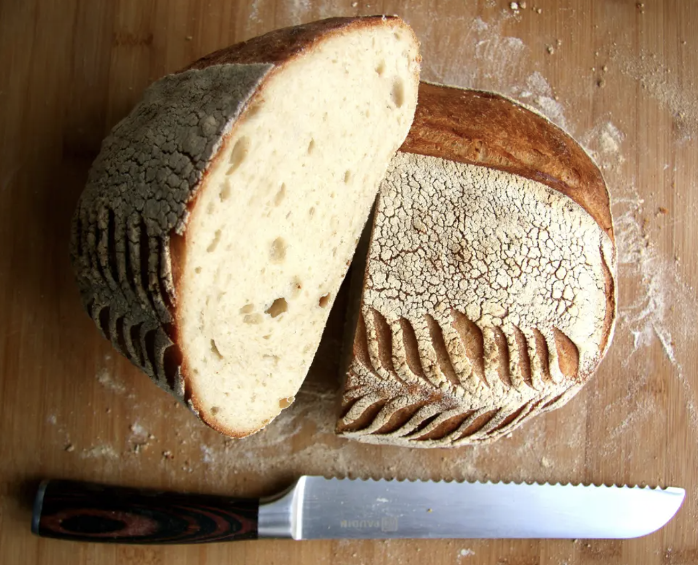

###### *RELATED* : 
---
Easy recipe for no knead sourdough bread using einkorn flour that even many gluten intolerant people can enjoy

---
## PREP | COMMENTS

[# From the book:  **Einkorn: Recipes for Nature's Original Wheat: A Cookbook**]

---
# INGREDIENTS

- [ ] 2 cups (474 g) warm filtered water 100°F/37.8°C
- [ ] 1/4 cup (60 g) refreshed sourdough starter see einkorn-based recipe below
- [ ] 6 cups (720 g) all-purpose einkorn flour
- [ ] 1 1/2 tsp sea salt finely ground

---
# INSTRUCTIONS

1. In a large bowl, mix together the water and yeast or starter until dissolved and creamy. Add the flour and salt and mix until all of the flour is absorbed and you have a sticky dough. Cover the bowl with plastic wrap and let rise in a dark place for 10 to 15 hours until the dough has doubled in size.

*Note that if you choose the yeast starter, your loaf will not convey the health benefits of sourdough. More on spotting fake sourdough at the store in this article.

2. Generously flour a work surface and transfer the dough to it. Use a dough scraper to fold the dough in thirds, dusting with flour as you go, then cup the dough with both hands and rotate in a circular motion between your hands until you have a tight, round loaf. Dust the top of the dough generously with flour.

3. Place a linen layer in a colander, heavily dusted with flour. Place the loaf seam side up in the colander, then fold over the linen to cover. Let proof at room temperature for 30 minutes.

4. Place a Dutch oven with the lid on in the oven. Preheat the oven to 500°F/260°C for 30 minutes.

5. Remove the pot from the oven and take off the lid. Invert the loaf and place it in the pot seam side down. Shake to center it, but if it sticks to the side leave it. Cover and place in the oven.

6. Reduce the oven temperature to 450°F/232°C and bake for 40 minutes. At this point, you can remove the pot from the oven and take off the lid. If you like your loaf darker, return the uncovered pot to the oven for 5 minutes.

7. Lift the loaf out of the pot with oven mitts. Place on a wire rack to cool for 2 hours before slicing. Wrap the loaf in a clean cotton or linen kitchen towel for up to 3 days, or freeze in a sealed plastic bag for up to 1 month.

---
## NOTES

1⁄4 teaspoon active dry yeast may be substituted for the einkorn sourdough starter in a pinch. Using sourdough starter will result in a more digestible loaf, however.

7 1⁄4 cups (696 g) whole grain einkorn flour, plus more for dusting can be substituted for the 6 cups of all purpose einkorn flour.

---
## TIPS

---
## NUTRITIONS

Amount Per Serving (1 slice)Calories 150Sodium 240mgCarbohydrates 30gFiber 3gProtein 4g

Hint! Once you’ve made your loaf, save the crusts and check out this recipe on how to make breadcrumbs.

---
### *EXTRA* :

