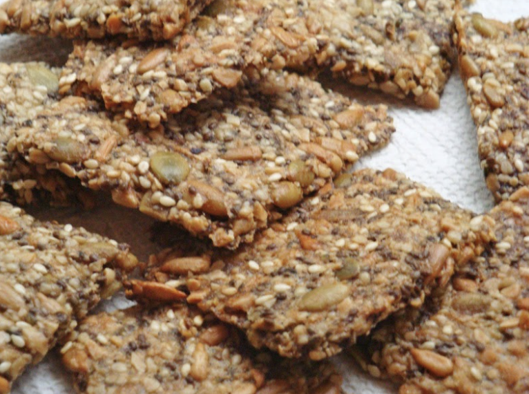

]]
###### *RELATED* : 
---

---
## PREP | COMMENTS

---
# INGREDIENTS

- [ ] ½ cup roughly chopped nuts, such as almonds or cashews essai 10 mai avec pacanes 
- [ ] ¼ cup pumpkin seeds (without shells)
- [ ] ¼ cup sunflower seeds (without shells)
- [ ] ¼ cup hemp seeds (may be called hemp hearts)
- [ ] 2 tbsp sesame seeds
- [ ] 2 tbsp whole chia seeds
- [ ] 1 tbsp psyllium husk powder (I used [Frontier](http://www.frontiercoop.com/products.php?cn=Psyllium) brand*)
- [ ] 2 tbsp coconut oil, butter, or [pasture tallow](http://fatworks.wazala.com/category/tallow-be-thy-name/)
- [ ] 1 and ¼ cups water
- [ ] ½ tsp salt
- [ ] ½ tsp coarse salt for top, or to taste
- [ ] Herbs and/or seasonings as desired, such as ground thyme, oregano, cumin, or pepper, or crushed fennel, caraway, or anise seeds, optional [Essai le 10 mai (sel, poivre, poudre d’ail, balilic, persil]

---
# INSTRUCTIONS

1. Preheat oven to 300 to 325 degrees F. [See Note below.) essai 325F 45 minutes 10 mai]
2. Grease a sheet pan (about 11- by 16-inches) or line with parchment paper.
3. Whisk chopped nuts and whole seeds together in a large, heat-resistant bowl. + salt Sprinkle psyllium powder evenly over mixture, being sure to break up any clumps, and stir in.
4. Place water in heat-proof container or pan and heat to boiling. Add coconut oil, butter, or tallow to water and continue to heat until melted. Pour over nut and seed mixture and mix well. Let stand for about 3 minutes until it hydrates to form a loose gel. While dough is still warm, use a spatula to spread evenly on pan. Sprinkle coarse salt and any optional herbs or seasonings over dough.
5. Bake for about 45 minutes (depending on oven temperature and desired amount of browning; see Note below). Remove from oven and score into squares or rectangles with a chef’s knife or a pizza cutter. Reduce oven temperature to 135 F and return crispbread to oven. Bake for another hour or so, watching carefully to avoid overcooking. Turn oven off and leave crispbread in oven with light on, until dry and crisp. Cut or break into pieces.
6. Serve with soup or cheese or use as a base for appetizers. Spread with butter or nut butter and sugar-free jam, or coat with melted chocolate. Alternately, press the dough into mini-muffin cups before baking and use as crunchy tart shells.

---
## NOTES

*[Frontier](http://www.frontiercoop.com/products.php?cn=Psyllium) brand psyllium powder is not gritty like some brands.

Note: This crispbread tastes best if you bake it at the higher temperature and let it get lightly brown, but the fragile oils in the nuts and seeds will suffer some damage from the heat. A lower temperature will preserve more nutrients. The drying time in a warm oven will still make them crisp, but it may take longer.

Makes 24 (2-x 3-inch) crispbreads.

---
## TIPS

---
## NUTRITIONS

Nutrition data with almonds: Calories: 48; Protein: 1.5g: Fat: 4.4g; Fiber: 0.65g: Net Carbs: 0.55g

---
### *EXTRA* :

