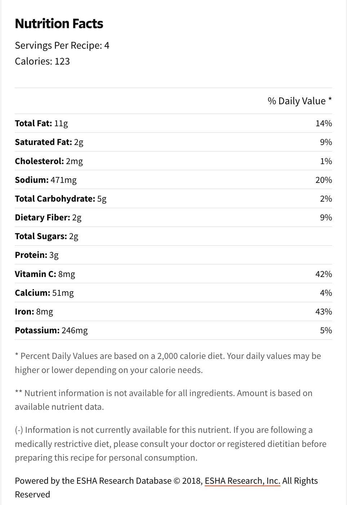

###### *RELATED* : 
---
Roasted asparagus seasoned with garlic, lemon, and Parmesan cheese. This recipe is super quick to prep and roasting removes any bitterness. Try it next to lamb or grilled fish.

---
## PREP | COMMENTS

Prep Time: 10 mins
Cook Time:15 mins
Total Time:25 mins

---
# INGREDIENTS

- [ ] 1 bunch thin asparagus spears, trimmed
- [ ] 3 tablespoons olive oil
- [ ] 1 ½ tablespoons grated Parmesan cheese (Optional)
- [ ] 1 clove garlic, minced (Optional)
- [ ] 1 teaspoon sea salt
- [ ] ½ teaspoon ground black pepper
- [ ] 1 tablespoon lemon juice (Optional)

---
# INSTRUCTIONS

1. Preheat an oven to 425 degrees F (220 degrees C).
2. Place the asparagus into a mixing bowl, and drizzle with the olive oil. Toss to coat the spears, then sprinkle with Parmesan cheese, garlic, salt, and pepper. Arrange the asparagus onto a baking sheet in a single layer.
3. Bake in the preheated oven until just tender, 12 to 15 minutes (12  Hunterhaven Rd) depending on thickness. Sprinkle with lemon juice just before serving.

---
## NOTES

---
## TIPS

---
## NUTRITIONS

---
### *EXTRA* :

