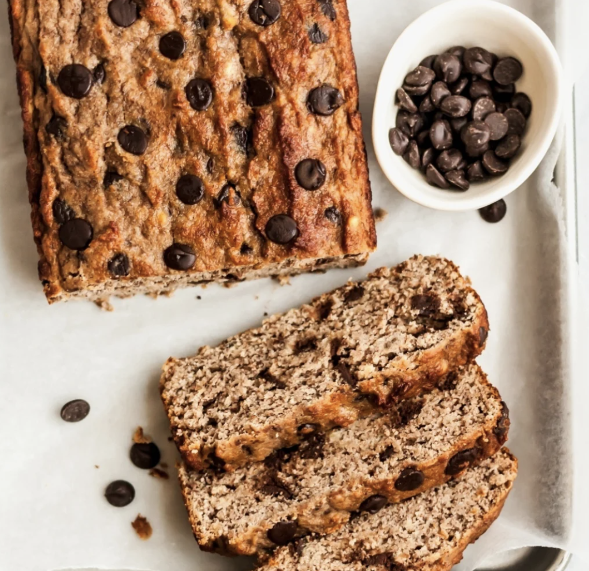

###### *RELATED* : 
---
_Paleo coconut flour banana bread that’s dairy free, gluten free and grain free. No sugar added. A fun and delicious way to use coconut flour!_

---
## PREP | COMMENTS

PREP TIME 10 MINS
COOK TIME 30 MINS
TOTAL TIME 40 MINS

---
# INGREDIENTS

- [ ] 1 1/4 cups mashed banana (about 3 medium ripe bananas, mashed)
- [ ] 1 teaspoon vanilla extract
- [ ] 1/4 cup almond butter
- [ ] 2 eggs, at room temperature
- [ ] 1/2 cup coconut flour
- [ ] 3/4 teaspoon baking soda
- [ ] 1/2 teaspoon cinnamon
- [ ] 1/4 teaspoon salt
- [ ] 1/2 cup chocolate chips, dairy free if desired plus extra for sprinkling on top

---
# INSTRUCTIONS

1. Preheat oven to 350 degrees F. Line a 8x4 inch or 9x5 inch loaf pan with parchment paper and spray with nonstick cooking spray.
2. In the bowl of an electric mixer or in a regular bowl, combine bananas, vanilla and almond butter; mix until well combined, smooth, and creamy. Add in eggs, one at a time and mix until combined. With the mixer on medium-low speed, add in coconut flour, baking soda, cinnamon and salt; mix again until just combined. Gently fold in chocolate chips.
3. Pour batter into prepared pan and smooth top. Sprinkle a few extra chocolate chips on top. Bake for 25-35 minutes or until tester inserted into center comes out clean. Remove from oven and place on wire rack to cool for 20 minutes, then carefully invert, remove bread from pan and place back on wire rack to cool completely. Cut into 12 slices.

---
## NOTES

For best results, use bananas with lots of brown spots.

Feel free to use peanut butter or cashew butter instead of almond butter. If you use sunflower seed butter, please know that the bread likely will turn green after baking due to a chemical reaction. Don't worry though, the bread will still be good!

---
## TIPS

---
## NUTRITIONS

---
### *EXTRA* :

